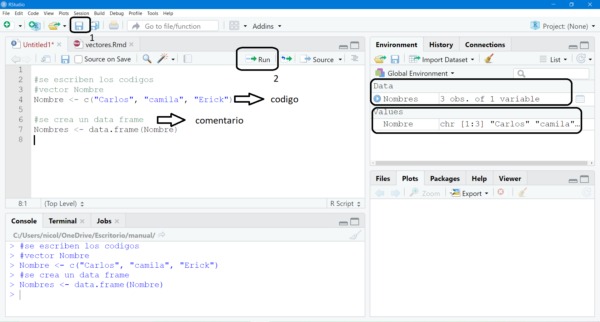

# Conceptos Básicos

<div style="text-align: justify">

En este capítulo veremos cómo instalar R y una breve explicación de sus diferentes ventanas, además veremos cómo utilizar la versión online de R conocido como R-cloud.

## Instalación

Para instalar R primero debemos ir al sitio oficial en el link siguiente:  https://cran.r-project.org/bin/windows/base/  y lo descargamos según las característica del computador. Se debe realizar doble click en el instalar de R, luego se debe ejecutar en el computador seleccionado “sí”  esto nos permite dar la autorización para que se instale R, luego escogemos el idioma deseado y luego se selecciona siguiente y “no” para la opción de configuraciones. 

{r echo=FALSE, out.width = "653px", out.height="320px",fig.align='center'}
knitr::include_graphics("static/img/instalarR.PNG")

Es recomendable crear un acceso directo desde el escritorio y una ves descargado procedemos a abrir RSturdio como se observa en la siguente imagen.

{r echo=FALSE, out.width = "653px", out.height="320px",fig.align='center'}
knitr::include_graphics("static/img/instlacionR1.PNG")


## La consola de R

Existen 4 ventanas, además de la barra de opciones en la parte superior.

{r echo=FALSE, out.width = "653px", out.height="320px",fig.align='center'}



**El editor (Ventana 1)**:  se trata del lugar donde editamos la sintaxis para posteriormente ejecutarla. Al escribir allí no sucederá nada, a no ser que se apriete algún botón para ejecutar los comandos o la tecla ctrl+enter.

**El entorno de variables (Ventana 2)** : es el “entorno de trabajo” del programa: en este lugar se muestra el conjunto de datos y los “objetos” (resultados, variables, gráficos, etc.) que se almacenan al ejecutar diferentes análisis.

**La consola (Ventana 3)** :  Corresponde a lo que sería el software R en su versión básica. Allí el software ejecuta las operaciones realizadas desde el editor de sintaxis.

**El editor (Ventana 4)**: Tiene varias subpestañas: 

1.	La pestaña files permite ver el historial de archivos trabajados con el programa; 

2.	La pestaña plots permite visualizar los gráficos que se generen; 

3.	La pestaña packages permite ver los paquetes descargados y guardados en el disco duro así como gestionar su instalación o actualización;

4.	La ventana help permite acceder al CRAN - Comprehensive R Archive Network (siempre que se cuente con conexión a Internet), página oficial del software que ofrece diferentes recursos para el programa: manuales para el usuario, cursos on line, información general, descarga de paquetes, información de los paquetes instalados, etc. Esta última pestaña es bastante útil: empleando el motor de búsqueda se accede de manera rápida a manuales de uso de los diferentes paquetes (y sus funciones) instalados en el computador (esto no requiere conexión a Internet);

5.	La ventana viewer muestra los resultados al construir reportes mediante funcionalidades tipo rmarkdown .

### Crear un script 
Los scripts son documentos de texto con la extensión de archivo . Estos archivos son iguales a cualquier documento de texto, pero R los puede leer y ejecutar el código que contienen.Aunque R permite el uso interactivo, es recomendable que guardes tu código en un archivo .R, de esta manera puedes usarlo después y compartirlo con otras personas.
#```{r echo=FALSE, out.width = "653px", out.height="320px",fig.align='center'}
#knitr::include_graphics("static/img/2.PNG")

#```

En la siguiente imagen, designado con el número 1 se observa la forma en que se debe guardar un script y con la asignación del numero 2 la forma que se corre un código esta genera en la consola la respuesta, que en este caso se observa en la venta 2 la creación de los vectores y el de la data frame. También se puede observar la diferencia en cómo se escribe un código y un comentario.

## R- cloud, plataforma online de R-Studio 

RStudio Cloud es una solución liviana basada en la nube que permite a cualquiera hacer, compartir, enseñar y aprender ciencia de datos en línea. 

### Crear  un script 
Primer caso es crear un cuenta con el correo institucional en R-Cloud en el siguiente enlace: https://rstudio.com/products/cloud/   una vez creada se crea un nuevo proyecto, como se observa en la siguiente imagen. 

#```{r echo=FALSE, out.width = "653px", out.height="320px",fig.align='center'}
#knitr::include_graphics("static/img/3.PNG")

#```


<div/>
