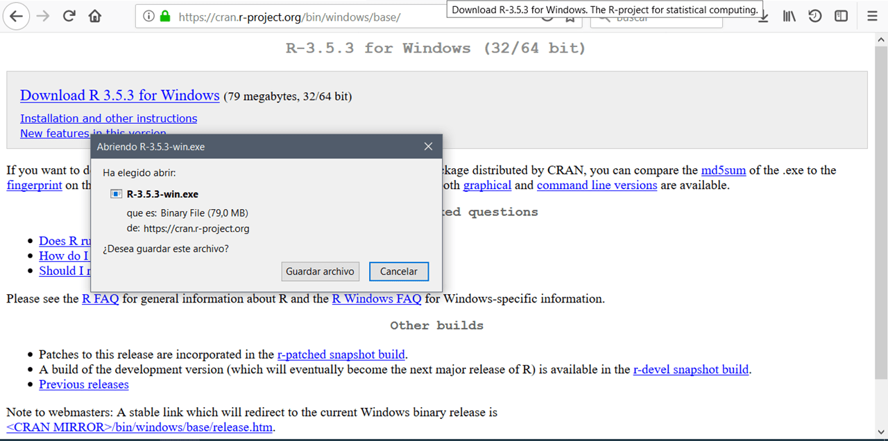
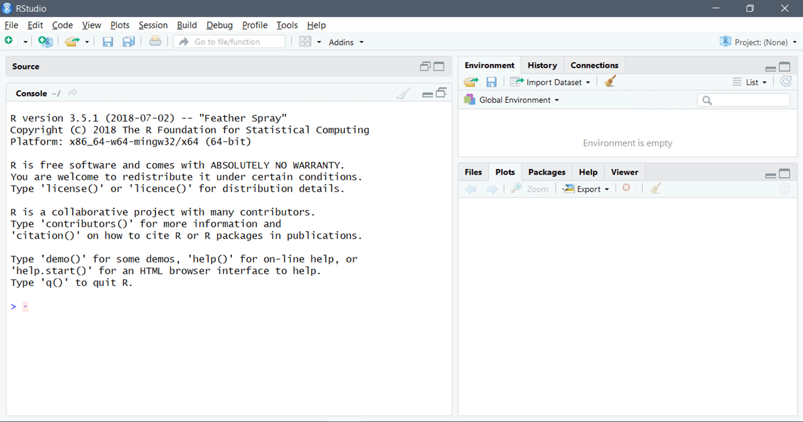

## ---
title: "Conceptos Básicos"
---
# Conceptos Básicos

<div style="text-align: justify">

En este capítulo veremos como instalar el programa R-Studio y explicaremos brevemente sus diferentes ventanas, como también revisaremos la versión online de R conocida como R-cloud.

## Instalación R

Para instalar R primero debemos ir al sitio oficial en el link siguiente:  https://cran.r-project.org/bin/windows/base/  y lo descargamos según las característica del computador. Se debe realizar doble click en instalar de R, luego se debe ejecutar seleccionado “sí”,  esto nos permite dar la autorización para que se instale R, luego escogemos el idioma deseado y luego se selecciona siguiente y “no” para la opción de configuraciones. 

```{r echo=FALSE, out.width = "653px", out.height="320px",fig.align='center', fig.cap='Instalar R.'}

```

Lo que acabamos de instalar corresponde al lenguaje de programación R, ahora debemos instalar R Studio que es un IDE o entorno de desarrollo integrado, R-Studio es un programa para manejar R. Para instalar R-Studio debemos dirigirnos al siguiente link: https://rstudio.com/products/rstudio/download/ . descargamos la versión de escritorio y según nuestro sistema operativo teniendo en cuenta las propiedades de nuestro dispositivo. Como se muestra en la siguiente imagen:

```{r echo=FALSE, out.width = "653px", out.height="320px",fig.align='center', fig.cap='Instalar R- Studio.'}
knitr::include_graphics("static/img/imagen2.1.2.png")
```

Es recomendable crear un acceso directo desde el escritorio y una vez descargado procedemos a abrir R- Sturdio como se observa en la siguiente imagen.

```{r echo=FALSE, out.width = "653px", out.height="320px",fig.align='center', fig.cap='R- Studio desde el escritorio.'}

```

## La consola de R

Existen 4 ventanas, además de la barra de opciones en la parte superior.

````{r echo=FALSE, out.width = "653px", out.height="320px",fig.align='center', fig.cap='ventanas de R_Studio.'}
knitr::include_graphics("static/img/imagen2.2.1.png")
```

**El editor (Ventana 1)**:  se trata del lugar donde editamos la sintaxis para posteriormente ejecutarla. Para que el código corra es necesario  apretar la tecla ctrl+enter.

**El entorno de variables (Ventana 2)** : En este lugar se muestra el conjunto de datos y los “objetos” (resultados, variables, gráficos, etc.) que se almacenan al ejecutar diferentes análisis.

**La consola (Ventana 3)** :  Corresponde a lo que sería el software R en su versión básica. Allí el software ejecuta las operaciones realizadas desde el editor de sintaxis.

**El editor (Ventana 4)**: Tiene varias subpestañas: 

1.	La pestaña files permite ver el historial de archivos trabajados con el programa; 

2.	La pestaña plots permite visualizar los gráficos que se generen; 

3.	La pestaña packages permite ver los paquetes descargados y guardados en el disco duro, así como gestionar su instalación o actualización;

4.	La ventana help permite acceder al CRAN - Comprehensive R Archive Network (siempre que se cuente con conexión a Internet), página oficial del software que ofrece diferentes recursos para el programa: manuales para el usuario, cursos on line, información general, descarga de paquetes, información de los paquetes instalados, etc. Esta última pestaña es bastante útil: empleando el motor de búsqueda se accede de manera rápida a manuales de uso de los diferentes paquetes (y sus funciones) instalados en el computador (esto no requiere conexión a Internet). 

### Crear un script 

Los scripts son documentos de texto con la extensión de archivo. Estos archivos son iguales a cualquier documento de texto, pero R los puede leer y ejecutar el código que contienen. Aunque R permite el uso interactivo, es recomendable que guardes tu código en un archivo. De esta manera puedes usarlo después y compartirlo con otras personas.

```{r echo=FALSE, out.width = "653px", out.height="320px",fig.align='center', fig.cap='Crear un script.' }
knitr::include_graphics("static/img/imagen2.2.2.png")
```
Wn la anterior imagen, se observa designado con el número 1  la forma en que se debe guardar un script y con la asignación del número 2 la forma que se corre un código generando la respuesta  en la consola , en cuanto la objeto ejecutado se observa en la venta 2.

## R- cloud, plataforma online de R-Studio 

RStudio Cloud es una solución liviana basada en la nube que permite a cualquiera hacer, compartir, enseñar y aprender ciencia de datos en línea. 

### Crear  un script 

Primer paso es crear un cuenta con el correo institucional (esto te permite tener un cuenta "gratis") en R-Cloud en el siguiente enlace: https://rstudio.com/products/cloud/   una vez creada se crea un nuevo proyecto, como se observa en la siguiente imagen. 

```{r echo=FALSE, out.width = "653px", out.height="320px",fig.align='center', fig.cap='R-studio cloud.'}
knitr::include_graphics("static/img/imagen2.3.1.1.png")
```

## Conocimientos básicos

### ¿Qué es un objeto?

R es un lenguaje orientado a objetos. Los objetos pueden ser usados para guardar valores y estos tiene la propiedad de poder modificarse mediante funciones. Por lo tanto, todos los datos y estructuras de datos son objetos, por lo que todos los objetos tienen un nombre para identificarlos. Para crear un objeto puedes usar `<-`:

```{r}
saludos <- "hola mundo" 
```
En el caso de números creamos el siguiente vector 
```{r}
calculos <- 5 * 6
```
Es importante destacar que los objetos pueden ser vectores, listas, matrices y data frame. 

### La importancia de los nombres

Los nombres de los objetos se deben comenzar con una letra para luego continuar con letras, números, `_` y/o `.` . Como recomendación es mejor que los nombres de los objetos sean descriptivos así es más fácil de escribir y retener al momento de escribir el código. Por ejemplo: 

```{r}
saludo_para.el_mundo <- "hola mundo" 
```

### Crear comentarios y titulo
Para crear cometarios en r se utiliza `#` puede ir arriba del código como a lado derecho de este y nos sirve para explicar los códigos creados.

```{r}
#codigo 
saludo_para.el_mundo <- "hola mundo"  # crear vector 
```

Si queremos crear un título en R también utilizaremos `#` pero este debe repetirse 4 veces a cada lado como en el siguiente ejemplo.

```{r}
#### codigo 1 #### 
saludo_para.el_mundo <- "hola mundo"  # crear vector 

```

Otra forma de crear un titulo es terminando en 4 guiones el comentario.

```{r}
# codigo 2 ----
saludo_para.el_mundo <- "hola mundo"  # crear vector 

```

La importancia de los títulos es que nos ayuda a ubicar diferentes procedimientos en los códigos, ya que este se puede abreviar con la flechita mostrada a lado izquierdo o se puede acceder al índice de R para ubicar el titulo como se muestra en la siguiente imagen. 

```{r echo=FALSE, out.width = "653px", out.height="320px",fig.align='center'}
knitr::include_graphics("static/img/imagen2.4.3.png")
```
### Sintaxis, Partes del código.

Para entender la sintaxis de los códigos debemos dividirlo en partes como se muestra en la siguiente imagen:

```{r echo=FALSE, out.width = "653px", out.height="320px",fig.align='center'}
knitr::include_graphics("static/img/imagen2.4.4.png")
```

El primer paso es indicar el `objeto`, con las especificaciones que indicamos con anterioridad. Luego se indica el `asignador`, que expresa que todo lo que este a la derecha de la flecha se guardará en el objeto creado. Luego el siguiente paso es escribir la `función`  para el ejemplo se usó `mutate()`, luego dentro de los paréntesis contiene los argumentos, el primero es el nombre del data frame, segundo y tercer argumento es para indicar que queremos que haga el código (esto depende de cada función).  

### Conceptos de Paquetes y librerías 

R puede ser expandido con paquetes. Cada paquete es una colección de funciones diseñadas para atender una tarea específica.  Estos paquetes se encuentran alojados en CRAN, así que pasan por un control riguroso antes de estar disponibles para su uso generalizado.
Para instalar paquetes se usa la función ` install.packages(), `dando como argumento el nombre del paquete que deseamos instalar, entre apostrofos.

Por ejemplo, para instalar el paquete corremos lo siguiente.
```{r eval=FALSE} 
install.packages('tidyverse')
```

Una vez realizado lo anterior, aparecerán algunos mensajes en la consola mostrando el avance de la instalación, luego de concluir la instalación de un paquete, podrás usar sus funciones con la función `library()`.

```{r}
library(tidyverse)
```

Es importante que tengas en cuenta que debes hacer una "llamada" a `library()` cada que inicies una sesión en R. 

### Memoria temporal del programa

R funciona como un entorno temporal de trabajo, esto quiere decir que el usuario va agregando datos y objetos a una script y trabaja con la memoria activa (RAM) del computador, por lo tanto, cualquier análisis sólo mostrará la información resultante pero no permanecerá como archivo posible de utilizar de modo posterior. 

<div/>
