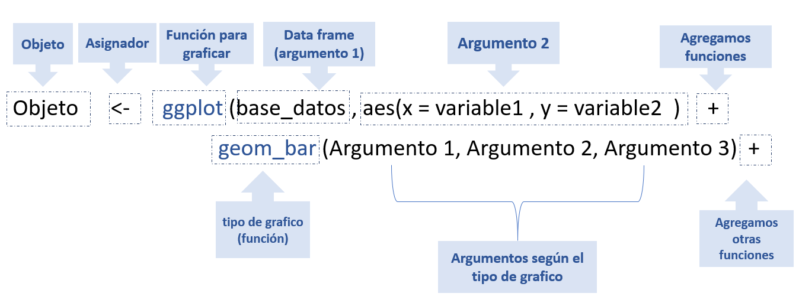
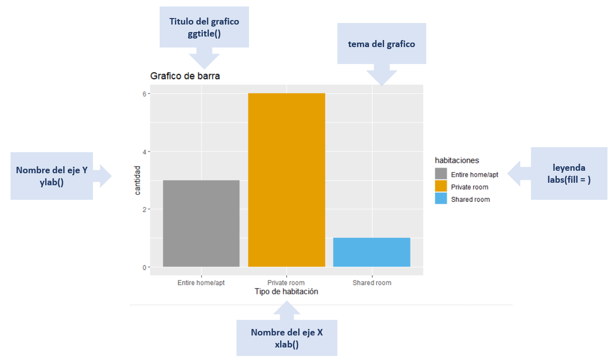
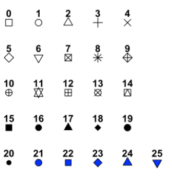

# Package Tidyverse 

<div style="text-align: justify">

Tidyverse es un conjunto de paquetes en R diseñados para ciencia de datos, el cual nos ayuda en todo el proceso de la importación, transformación, visualizar y modelación datos. Una de las principales ventajas es que tienen estos paquetes que comparten nombre y estructuras comunes, esto quiere decir que todos los nombres están en minúscula o que utilizan la barra baja para llamar a las funciones.

```{r}
#install.packages('tidyverse')
library(tidyverse)

```

Algunas librerías que contiene disponible **tidyverse** son los siguientes:

* readr
* dplyr
* tidyr
* tibble
* stringr
* forcats
* ggplot2

## library readr para importar datos

El objetivo de readr es proporcionar una forma rápida y sencilla de leer datos con formato csv, tsv y fwf . Está diseñado para analizar de manera flexible muchos tipos de datos. 

```{r}
library(readr)
```

### Leer datos tabulares
`readr` admite siete formatos de archivo con las siguientes funciones:

**CODIGO**          |         **DESCRIPCIÓN**  |
:-----------------|:-------------------------|
`read_csv("file.cvs")`| archivos separados por comas (CSV) |
`read_cvs2("file.cvs")`|archivos delimitados por punto comas |
`read_tsv("file.cvs")`| archivos separados por tabulaciones |
`read_delim("file.cvs")`| archivos delimitados generales |
`read_fwf("file.cvs")`| archivos de ancho fijo |
`read_table("file.cvs")`| archivos tabulares donde las columnas están separadas por espacios en blanco |
`read_log("file.cvs")`| archivos de registro web |


#### función para importar csv `read_csv()`

para llamar a read_csv tendrá el siguiente aspecto.

```{r eval=FALSE}
datos <- read_csv("data/datos_importates.csv")
```

`read_csv()` abrirá un archivo CSV y lo leerá línea por línea. También leerá en las primeras filas de la tabla para averiguar el tipo de cada columna (si esta pertenece a un entero, carácter, etc.). En el caso de que haber alguna dificultad para identificar el tipo de cada columna, esto se puede resolver usando el argumento `col_types`  mostrando a qué tipo pertenece la columna como `c` caracter y `i` entero y con el argumento `n_max` señalamos la cantidad de observaciones. como se muestra a continuación: 

````{r eval=FALSE}
datos <- read_csv("data/datos_importates.csv", col_types = "ccicccccci", n_max = 10)
```

#### función `read_csv2()`

`read.csv()` y `read.csv2()` están pensados para leer archivos de valores separados por comas con `.csv` o `read.csv2`. Para más información vea el siguiente link: https://readr.tidyverse.org/

### Leer datos no tabulares

**CODIGO**          |         **Descripción **  |
:-----------------|:-------------------------|
`read_file ( archivo, locale = default_locale ())`| Leer un archivo en una sola cadena|
`read_lines ( file, skip = 0, n_max = -1L, na = character (), locale = default_locale (), progress = interactive ())` |Leer cada línea en su propia cadena|
`read_log ( archivo, col_names = FALSE, col_types = NULL, skip = 0, n_max = -1, progress = interactive ())`|Leer archivos de registro de estilo Apache |
`read_file_raw ( archivo)`|Leer un archivo en un vector sin formato|
`read_lines_raw ( archivo, saltar = 0, n_max = -1L, progreso = interactivo ())`| Leer cada línea en un vector sin formato|

### Especificar el tipo de datos

En ocasiones es necesarios especificar el tipo de dato que posee cada columna para ellos se usa la función `cols()`.

```{r eval=FALSE}
cols (
     edad = col_integer (),
     sex = col_character (), 
    ganar = col_double ()
)
```

### Encoding 

Existen algunos problemas en la lectura de los archivos, como se muestra con el lenguaje en español ya que en algunos casos no reconoce los tildes y la ñ. Esto puede generar algunos problemas a la hora de utilizar algunos paquetes. Para ello usamos el argumento `encoding = `.

```{r eval=FALSE}
read_csv("file.cvs", encoding = "UTF-8")
```

Si no establece una codificación predeterminada, los archivos se abrirán con UTF-8 (en el escritorio Mac, el escritorio Linux y el servidor) o la codificación predeterminada del sistema (en Windows). El caso del español es recomendable utilizar el "ASCII" o el "ISO-8849-1". Pero es recomendable ir observando cómo se comporta los datos con diferentes enconding ya que no en todos los casos estos sirven para solucionar el problema. 

## Library dplyr para manipulación de datos

la librería **dplyr** es una gramática de manipulación de datos que proporciona verbos que ayudan a la manipulación de datos. Algunas funciones más importantes son las siguientes:

CODIGO | DESCRIPCIÓN|
:------:|:-----------|
`filter()`| Filtra datos basados en sus valores.|
`mutate()` | Agrega nuevas variables que son funciones de variables existentes|
`select()` | Elige variables en función de sus nombres.|
`summarise()`| Reduce varios valores a un solo resumen.|
`arrange()` | Cambia el orden de las filas.|
`slice()` | Elige filas según la ubicación.|
`relocate()` | Cambia el orden de las columnas.|

Todos ellos se combinan de forma natural con `group_by()`. 

Para más información vea el siguiente link. Cheatsheet :
https://rstudio.com/wp-content/uploads/2015/03/data-wrangling-spanish.pdf

A continuación, a través de la base de datos de Airbnb New York.

```{r echo=FALSE, message=FALSE}
airbnb <- read.csv("C:/Users/nicol/OneDrive/AB_NYC_2019.csv")
airbnb <- tail(airbnb, n = 10)
airbnb <- select(airbnb, id, neighbourhood_group , room_type, price)
```

```{r}
airbnb
```

```{r}
str(airbnb)
```
### Funciones principales

#### Función `mutate()` para realizar operaciones de columnas.

Es útil agregar nuevas columnas que sean funciones de columnas existentes. Con la función `mutate()` sirve más que nada para realizar operaciones matemáticas. Como, por ejemplo si queremos crear una columna de comisión con un 12%.

```{r}
airbnb %>% mutate(comision = price * 0.12)
airbnb 
```

Algunas funciones que se pueden complementar con la anterior función son las siguientes:

CODIGO | DESCRIPCIÓN|
:------:|:-----------|
`+`, `-`,`/`,`*`,`log()` | Operaciones matematicas|
`lag()` o `lead()`| Busca los valores "anterior"  o "siguiente"  en un vector.
`na_if()` , `coalesce()` | Para reemplazar los valores perdidos con un valor especificado|
`if_else()`, `recode()`, `case_when()`| Condicionales.


#### Seleccionar columnas con la función `select()`.

La función `select()` le permite acercarse rápidamente a un subconjunto.

```{r}
airbnb %>% select( id, room_type, neighbourhood_group)
```

Una forma contraria de usarla es agregando `!` que nos dices que queremos sacar esas variables de la data. 

```{r}
airbnb %>% select(!( id:room_type:neighbourhood_group))
```

Hay una serie de funciones auxiliares se pueden utilizar dentro `select()`, como los siguientes:

CODIGO | DESCRIPCIÓN|
:------:|:-----------|
`-`| Selecciona todas las variables excepto|
`:`| Selecciona un rango | 
`contains()`| Selecciona variables cuyo nombre contiene la cadena de texto| 
`everything()`| Selecciona todas las columnas|
`one_of()`|Selecciona variables cuyos nombres están en un grupo de nombres |
`starts_with()`| Comienza con un prefijo|
`ends_with()` | Termina con un sufijo.|
`contains()`| Contiene una cadena literal..|
`matches()`| Coincide con una expresión regular.|
`num_range ()` | Coincide con un rango numérico como x01, x02, x03.|


#### Función `filter()` para filtar observaciones.

Esta función nos permite seleccionar un subconjunto de filas en un marco de datos. Usaremos `%>%` para concatenar la data frame, luego dentro de la función pondremos el nombre de las variables que deseamos buscar o filtrar luego ponemos `==` todas las observaciones que tenga Brooklyn y para realizar el segundo filtro se separa con una coma para luego repetir lo anteriormente mencionado. 

Ahora queremos saber los alojamientos que se encuentra en la Brooklyn con habitación Entire home/apt.

```{r}
airbnb %>% 
  filter(neighbourhood_group  == "Brooklyn", room_type == "Entire home/apt")
```

El uso en la operación `%in%`, el cual funciona para recuperar más de un elemento de la misma columna o variable. 

```{r}
airbnb %>% 
  filter(neighbourhood_group  %in% c("Brooklyn","Queens"))
```

**Condiciones multiples**

Pero `filter()` permite otros tipos de condiciónales múltiples:


CODIGO | DESCRIPCIÓN|
:------:|:-----------|
`filter(condición1, condición2)`| Devolverá como resultado las filas que cumplan ambas condiciones.(,= Y)|
`filter(condición1, !condición2)` | Obtendrá como resulta las filas para las cuales se cumple la condición uno mas no la condición dos.(!= NO)|
`filter(condición1 | condición2)` | Elige variables en función de sus nombres.(|= O)|
`filter(xor(condición1, condición2)`| Obtendrá como resultado las filas en las que cumplan solo una de las condiciones.(,= Y)|

Ejemplo el precio mayor a 5 dólares y que este en el distrito de Brooklyn o que no pertenezca a Entire home/apt como tipo de habitación. 

```{r}
airbnb %>% 
  filter(price >= 5 , neighbourhood_group  == "Brooklyn", room_type == "Entire home/apt")
```

Filtrando las filas cuyas observaciones no contienen información (NA).

```{r}
airbnb %>% 
  filter(!is.na(price) )
```

CODIGO | DESCRIPCIÓN|
:------:|:-----------|
`Filter_all() `| actúa sobre todas las columnas.|
`Filter_if()` y`filter_at()` | actúa sobre un grupo específico de columnas.|

Antes de mostrar el ejemplo es importante destacar los siguientes comandos `any_vars()` es equivalente al condicional "o", así el comando `all_vars()` es equivalente al condicional "y".

El siguiente código selecciona todas las filas que contengan valores mayores a 5.
```{r}
airbnb %>% 
  filter_all(any_vars(. >= 5))
```


#### Función `arrange()` para ordenar observaciones.

La funciona `arrange()` selecciona filas y las reordena, para ello se necesita un marco de datos y un conjunto de nombres de columna para ordenar.

```{r}
airbnb %>% arrange(neighbourhood_group , room_type)
```

Esta se suele usar con la función `desc()`para ordenar de forma descendente.

```{r}
airbnb %>% arrange( desc(room_type))
```

#### Función `slice()` para seleccionar, eliminar y duplicar filas

Esta función permite indexar filas por sus ubicaciones (enteras), esto permite seleccionar, eliminar y duplicar filas. Por ejemplo, si queremos saber los caracteres de los números de filas 6 al 13.  

```{r}
airbnb %>% slice(6:13)
```

Otras variaciones son `slice_head()` y `slice_tail()` seleccione la primera o la última fila.

```{r}
airbnb %>% slice_tail(n = 6)
```

`slice_sample()`selecciona filas al azar.
```{r}
airbnb %>% slice_tail(n = 5)
```

Con las funciones `slice_min()` y `slice_max()` selecciona las filas con los valores más altos o más bajos de una variable.

```{r}
airbnb %>% slice_max(price, n = 3)
```

#### Función `relocate()` cambiar posición de las columnas.

Utilice una sintaxis similar `select()` a la de mover bloques de columnas a la vez.
```{r}
airbnb %>% relocate(price:id)
```

#### Función `summarise()` para realizar operaciones estadisticas.

El último verbo es summarise(). Colapsa un marco de datos en una sola fila.
```{r}
airbnb %>% summarise(price_mean = mean(price))
```

#### argumentos complementarias de la función `summarise()`

CODIGO | CODIGO | DESCRIPCIÓN|
:------:|:-----------:|:-----------|
`mean()`| Medida aritmética |Función genérica para la media aritmética|
`median()`| Medida aritmética |Función genérica para la mediana aritmética|
`sd()` |Propagación | Calcula la desviación estándar de los valores.|
`IQR()` |Propagación | Calcula el intervalo intercuartil de los valores.
`mad()` |Propagación | Calcula la mediana de desviación absoluta.
`min()` |Gama| Calcula la minima.
`max()` |Gama| Calcula el maximo.
`mad()` |Gama| Produce cuantilos de muestra correspondientes a las probabilidades dadas..
`n()` |Contar| Cuenta la cantidad.
`n_distinct()` |Contar| Cuenta la cantidad de observaciones distintas.
`all()` |Lógica| Dado un conjunto de vectores lógicos, ¿todos los valores son verdaderos?.
`any()` |Lógica|Dado un conjunto de vectores lógicos, ¿es al menos uno de los valores verdaderos?

##### `summarise()` varias columnas

CODIGO | DESCRIPCIÓN|
:------:|:-----------|
`summarise_all()`|  Afecta a todas las variables|
`summarise_at()` | Afecta a las variables seleccionadas con un vector de caracteres o `vars()`.|
`summarise_if()`|  Afecta a las variables seleccionadas con una función de predicado.|

### Funciones sencundarias

#### Obtener las observaciones distintas con distinct().

La función `distinct()` devuelve valores únicos en una data, se suele usar en conjunto con `select()` :

```{r}
distintos <- distinct(select(airbnb, room_type))
distintos
```
#### agrupar observaciones con `group_by()`

Esta función toma una tbl existente y la convierte en una tbl agrupada donde las operaciones se realizan "por grupo".

```{r}
airbnb %>% 
  group_by(room_type) %>% 
summarise(price_mean = mean(price))
```

Otra variación de la anterior función `group_by_at()` en el cual utilizamos en número de columna. 

```{r}
airbnb %>% 
  group_by_at(3) %>% 
mutate(price_mean = mean(price))
```
#### Crear una condicional con `ifelse()`

la Función `if()`  es usada cuando deseamos que una operación se ejecute únicamente cuando una condición se cumple y `else()` es usada para indicarle que hacer en caso de la condición de un `if()` no se cumpla. ejemplo queremos crear una variable llamada tipo_de_precio que determine si el rango de precio es costosos o barato, si el precio es menor a 100 es barato de lo contrario es costoso.  

```{r}
airbnb %>% mutate (tipo_de_precio = ifelse(price < 100 , "barato", "costoso") )
  
```
Pero si queremos agregar más de una condicional por ejemplo por ejemplo si es menor o igual a 40 dólares es muy barato y si es mayor o igual a 200 es lujoso.

```{r}
airbnb %>% mutate (tipo_de_precio = ifelse(price <= 40 , "muy barato", 
                                     ifelse(price < 100 , "barato", 
                                    ifelse(price >= 200 ,  "lujoso", "costoso")))) 
                                    
                                        
                                            
  
```

```{r}
airbnb %>% mutate (tipo_de_precio = if_else(price < 100 , "barato", "costoso") )
  
```


## Library tidyr para crear datos ordenados

la libreria **tidyr** crear datos ordenados. Los datos ordenados son datos donde:

* Cada columna es variable.
* Cada fila es una observación.
* Cada celda es un valor único.

Tidy data describe una forma estándar de almacenar datos que se utiliza siempre que sea posible en tidyverse . Si se asegura de que sus datos estén ordenados.


```{r}
library(tidyr)
```

Ahora veremos algunas funciones principales que podemos encontrar en la librería. 

### Unir las columnas en pares clave-valor con la función `gather()`

Esta función toma múltiples columnas y las une en pares clave-valor. Por ejemplo, tenemos la cantidad de vuelos internacionales de cada ciudad del año 2000 al 2003.
```{r}
Pais <- c("Chile_Santiago", "Peru_Lima", "Colombia_Bogota")
vuelo_2000 <- c(109002, 145240, 152421)
vuelo_2001 <- c(108502, 148540, 125161)
vuelo_2002 <- c(123230, 196232, 125843)

vuelos_internacionales <- data.frame(Pais, vuelo_2000, vuelo_2001, vuelo_2002)

vuelos_internacionales

```

Queremos unir las columnas vuelos 2000, 2001 y 2002, para ello usaremos la función `gather()`  que tome el data frame vuelos_internacionales, y una las columnas 2:4, metiendo el resultado en el par clave (vuelos) – valor (total vuelos).

```{r}
vuelos_internacionales1<- gather(data = vuelos_internacionales, key = "Vuelo", value = "total_vuelos", 2:4)
vuelos_internacionales1
```
### Distribuya un par clave-valor en varias columnas con la función `spread()`

Esta función es usada cuando tenemos una observación dispersa en múltiples filas. Por ejemplo si tenemos el data frame anterior y queremos pasarlo a su estado original separando cada vuelo en columna se usa la función `spread()`.

```{r}
spread(data = vuelos_internacionales1, key = Vuelo, value = total_vuelos)
```

### Separar una columna en varias columnas con la función `separate()`

La Función `separate()` sirve para separar observaciones, por ejemplo queremos separar las observaciones que se Encuentran en la variable país en dos, una que contenga los países y otra que contenga la ciudades. 

```{r}
vuelos_internacionales2 <- separate(data =  vuelos_internacionales1, 
         col  =  Pais,  
         into =  c("pais", " ciudad"), 
         sep  =  "_")
vuelos_internacionales2
```
Por defecto, la función `separete` usa como separador cualquier valor no alfa-numerico.

### Une varias columnas en una con la función `unite()`
Esta función es la contraria de la anterior función.
```{r}
# se unen las columnas 
vuelos_internacionales2 <-  unite(vuelos_internacionales2 ,pais, c(2,3) ,  sep = ",", remove = TRUE)

```

Si agregamos la función `Mutate()` antes de la función  `unique()` se creara una nueva columna manteniendo las variables originales que se unieron. 

## Library stringr para la manipulación de las observaciones.

Con la librería stringr Hay cuatro principales funciones, el primero es la manipulación de caracteres; estas funciones le permiten manipular caracteres individuales dentro de las cadenas en vectores de caracteres. La segunda son las herramientas de espacios en blanco para agregar, eliminar y manipular espacios en blanco, el tercero son las operaciones sensibles a la configuración regional cuyas operaciones variarán de una ubicación a otra y por último son las funciones de coincidencia de patrones.

```{r}
library(stringr)
```

Algunas funciones estacadas son las siguientes.

### Manipulación de la observación.

Podemos obtener la longitud de la cadena con la función `str_length()`:
```{r}
 str_length("hola")
```

Se puede acceder a una letra específica con la función `str_sub()` colocando la variable y luego la posición que deseamos buscar en este caso la 2.

```{r}
A <- c("hola", "hello" )

str_sub(A, 2, 2)
```

Estos nos sirven también para modificar la cadena por ejemplo queremos remplazar la o y la e por una X .  

```{r}
str_sub(A, 2, 2) <- "X" 
A
```

También podemos duplicar las cadenas con la función `str_dup()`. 
```{r}
str_dup(A, c(2, 2))
```
### Especio en blanco 

Con la función `str_pad()` rellena una cuerda a una longitud fija agregando espacios en blanco adicionales a la izquierda, derecha o ambos lados.

```{r}
str_pad(A, 10)
```
```{r}
str_pad(A, 10, "both")
```
Entonces, si desea asegurarse de que todas las cadenas tengan la misma longitud, combine `str_pad()` y `str_trunc()`:

```{r}
A %>% 
  str_trunc(10) %>% 
  str_pad(10, "right")
```
 
Lo contrario de lo anterior es la función `str_trim()` que elimina los espacios en blanco. 
 
```{r}
A <- c("  hola  ", "  hello  " )
str_trim(A)
```

Agregaremos left para indicar que dirección eliminar.

```{r}
str_trim(A, "left")
```

Puede utilizar la función `str_wrap()` para modificar los espacios en blanco existentes para ajustar un párrafo de texto, de modo que la longitud de cada línea sea lo más similar posible.
 
### Sensible a la configuración regional

Si queremos modificar las palabras de pasarla de minúscula a mayúscula se utiliza la función `str_to_upper()`.

```{r}
A <- c("hola", "hello" )
A <- str_to_upper(A)
A
```

De mayúscula a minúscula.  

```{r}
str_to_title(A)
```

Sí queremos ordenar y clasificar la cadena usaremos la función `str_order()` y `str_sort()`.

```{r}
B <- c("c", "b", "e")
str_order(B)

```
```{r}
str_sort(B)
```

### La coincidencia de patrones

La gran mayoría de funciones de stringr funcionan con patrones, estos están parametrizados por la tarea que realizan y los tipos de patrones que coinciden.
```{r}
numeros <- c(
  "celular", 
  "219 733 8965", 
  "329-293-8753", 
  "casa: 579-499-7527; trabajo: 543.355.3679"
)
telefonos <- "([2-9][0-9]{2})[- .]([0-9]{3})[- .]([0-9]{4})"
```

Usaremos la función `str_detect()` detecta la presencia o ausencia de un patrón y devuelve un vector lógico. Por ejemplo, para saber cuál pertenece a un número telefónico.  

```{r}
str_detect(numeros, telefonos)
```

Con la función `str_subset()` devuelve los elementos de un vector de caracteres que coinciden con una expresión regular. 

```{r}
str_subset(numeros, telefonos)
```

Ahora con la función `str_count()` cuenta el número de coincidencias, por ejemplo, queremos saber cuántos números de teléfonos existe en la cadena.

```{r}
str_count(numeros, telefonos)
```

Con la función `str_locate()` localiza la primera posición de un patrón y devuelve una matriz numérica con columnas al comienzo y al final, por ejemplo, si queremos saber en qué parte de la cadena se encuentra el número de teléfono.

```{r}
str_locate(numeros, telefonos)
```
 
La función `str_locate_all()` localiza todas las coincidencias, devolviendo una lista de matrices numéricas. 

```{r}
str_locate_all(numeros, telefonos)
```

Si queremos extraer el texto correspondiente a la primera coincidencia, devolviendo un vector de caracteres con la función `str_extract()`.

```{r}
str_extract(numeros, telefonos)
```

Si queremos ver todos los números telefónicos usaremos la función `str_extract_all()`.

```{r}
str_extract_all(numeros, telefonos)
```

Ahora si queremos remplazar los números usaremos la función `str_replace()` reemplaza el primer patrón coincidente y devuelve un vector de caracteres. 

```{r}
str_replace(numeros, telefonos, "XXX-XXX-XXXX")
```
```{r}
str_replace_all(numeros, telefonos, "XXX-XXX-XXXX")
```


## Library ggplot2 para graficar.

Con esta Librería podemos construir diferentes gráficos que nos ayuda a entender mejor los datos, todos los gráficos que pertenecen en ggplot2 comienzan con una llamada a `ggplot()`, proporcionando datos predeterminados y asignaciones estéticas, especificadas por `aes()`.  En el siguiente diagrama se muestra la sintaxis básica para armar un código para graficar: 

```{r echo=FALSE, out.width = "653px", out.height="320px",fig.align='center', fig.cap='sintaxis basica para grafica en R.' }

```
Como se observó en el diagrama anterior, toda las nuevas funciones se agregan usando `+` y la función que determina el tipo de grafico se agrega luego de la función `ggplot()`. A continuación, veremos en la siguiente imagen las partes básicas de un gráfico.

```{r echo=FALSE, out.width = "653px", out.height="520px",fig.align='center',fig.cap='Partes basicas de un gráfico en R.' }

```
Para explicar los diferentes gráficos que posee esta librería usaremos la base de datos de airbnb, mostrando los argumentos de las funciones que determina el tipo del gráfico y las diferentes funciones complementarias. 

```{r, echo=FALSE}
library(tidyverse)
airbnb <- read.csv("C:/Users/nicol/OneDrive/AB_NYC_2019.csv")
airbnb <- tail(airbnb, n = 10)
airbnb <- select(airbnb, id, neighbourhood_group , room_type, price, availability_365)
```

```{r}
head(airbnb)
```


### Gráficos de Barras `Barplot()`

Uno de los tipos de gráficos más comunes en el análisis de datos es el gráfico de barras. Para formar el código del grafico primero debemos llamar la función `ggplot()` en data debemos colocar el nombre del dataset. En cuanto en la función `aes()` se coloca la variable que va en el eje X, luego agregando  `+` se estable el tipo de grafico que queremos tener en este caso es un gráfico de barra `geom_bar()`. 

```{r}
ggplot(data = airbnb, aes(x = room_type)) + geom_bar()
```

Argumentos que podemos agregar a la función `geom_bar()`: 

**Argumentos ** |**Descripción** |
:--------------|:---------------|
`width = ` | Grosor de la barra. |
`color = ` |Color del borde del de los gráficos. |
`fill =`| Color de interior del grafico |

Como podemos ver en el siguiente gráfico: 
```{r}
ggplot(data = airbnb, aes(x = room_type)) + 
  geom_bar(width = 0.5, color = "blue" ,fill = "white" )
```

Algunas funciones complementarias que podemos utilizar:

**funciones ** |**Descripción** |
:--------------|:---------------|
`aes()` |  Con esta función configura la variable categórica para el eje X, usa el numérico para el eje Y. |
`geom_bar()` |Título del gráfico. |
`ggtitle()`| Título del grafico |
`xlab()` | Nombre de los ejes X . |
`ylab()` |Nombre de los ejes Y . |
`coord_flip()`| Cambiar la orientación de los ejes|
`labs(fill = )`| Para cambiar el título de la leyenda|
`geom_text()`| Etiquetas en las barras| 

Puedes ver los colores disponibles el siguiente link: http://www.stat.columbia.edu/~tzheng/files/Rcolor.pdf
 
```{r}
ggplot(data = airbnb, aes(x = room_type)) +
  geom_bar(width = 0.9, fill = "blue" ) + 
  ggtitle("Grafico de barra")+ 
  xlab("Tipo de habitación") + 
  ylab("cantidad")+
  coord_flip()+
  labs(fill = "habitaciones" )

```
También podemos agregar etiquetas a los gráficos para ellos usamos la función `geom_text()`, y algunos de los argumentos de la función `geom_text()`: 

**Argumentos ** |**Descripción** |
:--------------|:---------------|
`vjust = ` | La ubicación de la etiqueta marcando el término de la barra como referencia 0 |
`size = ` |Tamaño de la letra. |
`color =`| Color de la letra |

#### Leyenda de la barra y color 

Para agregar color a las barras usamos las siguientes funciones: 

**Función ** |**Descripción** |
:--------------|:---------------|
`scale_color_manual ()` |  Para usar colores personalizados|
`scale_color_brewer () ` |Para usar paletas de colores del paquete RColorBrewer |
`scale_color_grey () `| Para usar paletas de colores grises |

Además si agregamos el argumento `fill = as.factor(room_type)` en la función `ggplot()` agregamos una leyenda para habitaciones y para cambiar el nombre se usa la función `labs(fill = "" )`.

```{r}
ggplot(data = airbnb, aes(x = room_type, fill = as.factor(room_type))) +
  geom_bar(width = 0.9) + 
  scale_color_grey ()+
  scale_fill_manual (values=c("#999999", "#E69F00", "#56B4E9"))+
  ggtitle("Grafico de barra")+ 
  xlab("Tipo de habitación") + 
  ylab("cantidad")+
  labs(fill = "habitaciones" )
```


para cambiar la posición de la leyenda usamos la función `theme(legend.position="")` agregando un top para poner la leyenda en la parte superior y bottom en la parte inferior. 

```{r}

ggplot(data = airbnb, aes(x = room_type, fill = as.factor(room_type))) +
  geom_bar(width = 0.9) + 
  scale_color_grey ()+
  scale_fill_manual (values=c("#999999", "#E69F00", "#56B4E9"))+
  ggtitle("Grafico de barra")+ 
  xlab("Tipo de habitación") + 
  ylab("cantidad")+
  labs(fill = "habitaciones" )+
  theme(legend.position="bottom")
```

#### Con múltiples grupos 

si queremos realizar gráficos con múltiples variable debemos agregar a la función `aes()` el argumento `fill = ` en este caso usamos los distritos y además agregamos en la `y =` los precios de las habitaciones.
```{r}
ggplot(data = airbnb, aes(x = room_type, y = price , fill = neighbourhood_group)) +
  geom_bar(stat="identity") + 
  scale_color_grey ()+
  scale_fill_manual (values=c("#999999", "#E69F00", "#56B4E9"))+
  ggtitle("Grafico de barra")+ 
  xlab("Tipo de habitación") + 
  ylab("precio")+
  labs(fill = "habitaciones" )
```

Ahora otra forma de realizar el mismo grafico anterior solo cambiando la posición de la barra es agregando en la función `geom_bar()` el argumento `position=position_dodge()` es de la siguiente manera: 


```{r}
ggplot(data = airbnb, aes(x = room_type, y = price , fill = neighbourhood_group)) +
  geom_bar(stat="identity", position=position_dodge()) + 
  scale_color_grey ()+
  scale_fill_manual (values=c("#999999", "#E69F00", "#56B4E9"))+
  ggtitle("Grafico de barra")+ 
  xlab("Tipo de habitación") + 
  ylab("precio")+
  labs(fill = "habitaciones" )
```
La función `geom_errorbar()` se puede utilizar para producir un gráfico de barras con barras de error.

### Diagrama de caja con la función `geom_boxplot ()`
Boxplots o gráficos de caja, son útiles para visualizar la distribución de los datos de acuerdo con una variable o condición de interés.

Argumentos de la función `geom_boxplot ()`: 

**Argumentos ** |**Descripción** |
:--------------|:---------------|
`outlier.colour= ` |  Color del punto periférico. |
`outlier.shape  = ` | Forma del punto periférico. |
`outlier.size =`| Tamaño del punto periférico. |
`notch=TRUE` | Forma de la caja |
`fill=` | Color de la caja |
`color=`| Color del borde de la caja | 

```{r}
ggplot(airbnb, aes( x = room_type,  y = availability_365 )) + 
  geom_boxplot(outlier.colour="black", outlier.shape=16,
             outlier.size=2, fill = "#E69F00", color= "black")

```

Algunas funciones complementarias que podemos utilizar:

**funciones ** |**Descripción** |
:--------------|:---------------|
`aes()` |  Con esta función configura la variable categórica para el eje X, usa el numérico para el eje Y. |
`geom_bar()` |Título del gráfico. |
`ggtitle()`| Titulo del grafico |
`xlab()` | Nombre de los ejes X . |
`ylab()` |Nombre de los ejes Y . |
`coord_flip()`| Cambiar la orientación de los ejes|
`labs(fill = )`| Para cambiar el título de la leyenda|
`geom_text()`| Etiquetas en las barras| 


La función `stat_summary ()` se puede usar para agregar puntos medios a un diagrama de caja:

```{r}
ggplot(airbnb, aes( x = room_type,  y = availability_365 )) + 
  geom_boxplot(outlier.colour="black", outlier.shape=16, outlier.size=2) +
  ggtitle("Grafico de barra")+ 
  xlab("Tipo de habitación") + 
  ylab("precio")+
  labs(fill = "habitaciones" )
  
```

Si queremos agregar puntos usamos las funciones `geom_dotplot ()` o `geom_jitter ()` :

```{r}
ggplot(airbnb, aes( x = room_type,  y = availability_365 )) + 
  geom_boxplot(fill = "#E69F00", outlier.shape=16, outlier.size=2) +
  ggtitle("Grafico de barra")+ 
  xlab("Tipo de habitación") + 
  ylab("precio")+
  labs(fill = "habitaciones" )+
  geom_jitter(shape=16, position=position_jitter(0.2))


```

### Gráficos de dispersión con la función `geom_point ()`

El diagrama de dispersión permite estudiar las relaciones entre dos conjuntos asociados de datos que aparecen en pares. Algunos
argumentos de la función `geom_point ()`: 


**Argumentos** |**Descripción** |
:--------------:|:---------------|
`size =` | 	Tamaño de fuente base, expresado en pts. |
`shape = ` | La forma del punto. |
`colour = ` |color del borde del punto |
`fill = ` | color del fondo del punto |

Para realizar el ejemplo anterior vamos a crear una nueva variable llamada ingreso: 
```{r}
airbnb <- airbnb %>% mutate(ingreso = price * 1,15 )
```

```{r}
ggplot(airbnb, aes( x = price, y = ingreso )) + 
geom_point(size=2, shape=23)
```

Para cambiar la forma del punto puedes elegir uno de los que se muestra en la siguiente imagen: 

```{r echo=FALSE, out.width = "353px", out.height="220px",fig.align='center',fig.cap='Forma del punto.' }

```

### Temas de los gráficos 

Como observamos en la Figure 4.2: Partes basicas de un gráfico en R. Para cambiar el tema de un grafico se usa función `theme_()`. a A continuación, veremos el ejemplo que utilizaremos para ilustrar los diferentes temas disponibles. 

```{r}
grafico <-ggplot(data = airbnb, aes(x = room_type, fill = as.factor(room_type))) +
              geom_bar(width = 0.9) + 
              scale_color_grey ()+
              scale_fill_manual (values=c("#999999", "#E69F00", "#56B4E9"))+
              ggtitle("Grafico de barra")+ 
              xlab("Tipo de habitación") + 
              ylab("cantidad")+
              labs(fill = "habitaciones" )
```

**Argumentos** |**Descripción** |
:--------------:|:---------------|
`base_size` | 	Tamaño de fuente base, expresado en pts. |
`base_family` | Familia de fuentes base. |
`base_line_size` |Tamaño base para elementos de línea |
`base_rect_size` | Tamaño base para elementos rect|

En cuanto a las funciones que cambian el color del tema son los siguiente:

**funciones ** |**Descripción** |
:--------------|:---------------|
`theme_gray()` |   Fondo gris y líneas de cuadrícula blancas. |
`theme_bw()` | Fondo blanco y líneas de cuadrícula gris. |
`theme_linedraw()`| Fondo blanco y líneas de cuadrícula negra. |
`theme_light()` | fondo blanco y líneas de cuadrícula gris (mas intensa las líneas)|
`theme_dark()` |Lo mismo que lo anterior pero con fondo negro. |
`theme_minimal()` |Tema minimalista sin anotaciones de fondo . |
`theme_classic()`| Un tema de aspecto clásico, con líneas de eje x e y,y sin líneas de cuadrícula|
`theme_void()` |Un tema completamente vacío. |
`theme_classic()`| Enmarca el grafico|

```{r}
grafico  + theme_gray()
```

```{r}
grafico  + theme_bw()
```

```{r}
grafico  + theme_linedraw()
```

```{r}
grafico  + theme_light()
```

```{r}
grafico + theme_dark()
```

```{r}
grafico + theme_minimal()
```

```{r}
grafico + theme_classic()
```

```{r}
grafico + theme_void()
```

```{r}
grafico + theme_test()
```


## Otros packages relacionados.

### Packages data.table

data.table es un paquete extremadamente rápido y eficiente en memoria para transformar datos en R. Funciona convirtiendo los objetos de marco de datos nativos de R en data.tables con una funcionalidad nueva y mejorada. 

**dt[i,j, by]**

**dt**  Toma data.table.
**i**   Subconjunto de filas usando.
**j**   Manipular columnas.
**by** Agrupados según.

Ejemplo tenemos el data frame BaseA.
```{r include=FALSE}
library(dplyr)
library(tidyr)
#vectores 
A <- c("x1", "x2", "x3", "x4", "x5", "x6")
ID <- c( 1, 2, 3, 4, 5, 6)
B <- c("y1", "y2", "y3", "y4", "y5", "y6")
# data frame
baseA <- data.frame(ID, A)
baseB <- data.frame(ID, B)

baseC <- baseA %>%
  inner_join(baseB, by = "ID")
```

```{r}
baseC <- baseA %>%
  inner_join(baseB, by = "ID")
```

**Subconjunto de filas usando i**

Subconjunto de filas basadas en números de fila.
```{r}
baseC[1:3,]
```
 Filas de subconjunto basadas en valores en una o más columnas.

```{r}
baseC[ID>3,]
```
**Manipular columnas con j **
Extraer columnas por número. Prefije los números de columna con "-" para eliminarlos.
```{r}
baseC[,c(2)]
```

 extraer columnas por nombre.
```{r}
baseC[,c("A")]
```

#### Funciones para data.tables
```{r include=FALSE}
library(dplyr)
library(tidyr)
#vectores 
A <- c("x1", "x2", "x3", "x4", "x2", "x3")
ID <- c( 1, 2, 3, 4, 2, 3)

# data frame
baseA <- data.frame(ID, A)

```

```{r}
baseA
```

Extrae filas únicas según las columnas especificadas en "by". Deje "por" para usar todas las columnas.

```{r}
unique(baseA, by = c("ID")) 
```


#### Leer y escribir archivos
 En el caso de importar datos se usa la función `fread()`

**TIPO ** |**CODIGO**          |         **DESCRIPCIÓN**  |
:-----------|:-----------------|:-------------------------|
Importar |`fread (" file.csv ")` |  Lee datos de un archivo plano como .csv o .tsv en R|
exportación | `fwrite(dt, "file.csv")` |Escribe datos en un archivo plano desde R|


Para más información vea el siguiente enlace.

Cheatsheet: https://github.com/Rdatatable/data.table

<div/>
