title: 'Análisis de datos '
---

# Análisis de datos
<div style="text-align: justify">

En este capítulo aplicaremos todo lo aprendido en el capítulo anterior, siguiendo los pasos nombrados en la Figure 1.1: Proceso de programación, para ello el primer paso es instalar la librería tidyverse.


```{r}
library(tidyverse)
```
##  Importar base de datos.


Ahora demostraremos como cargar la data tanto para r-studio de escritorio como para R- cloud (versión online).

### Desde R-Studio de escritorio  

Para importar bases de datos en formato Excel en R- studio se ingresa en la ventana 2 en donde dice **Import Dataset** como se observa en la siguiente imagen.

```{r echo=FALSE, out.width = "960x", out.height="205px",fig.align='center', fig.cap='Importar base de datos desde R-Studio.`}
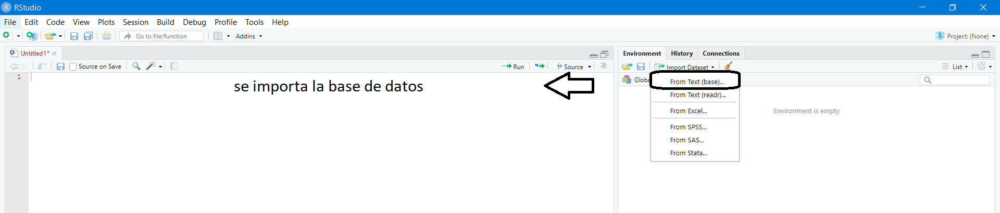
```
Luego aparece una ventana en donde buscamos nuestra base de datos en nuestro computador, y una vez seleccionado el archivo aparece una segunda ventana llamada Import Dataset como se muestra en las dos siguientes imágenes. En la primera es la forma correcta de subir la base de datos como se encuentra demarcado el Heading colocamos YES esto es con el fin de que la base de datos que subamos tenga el encabezado correspondiente como se encuentra demostrado en la imagen.

```{r echo=FALSE, out.width = "532px", out.height="409px",fig.align='center', fig.cap='Importar base de data set.`}
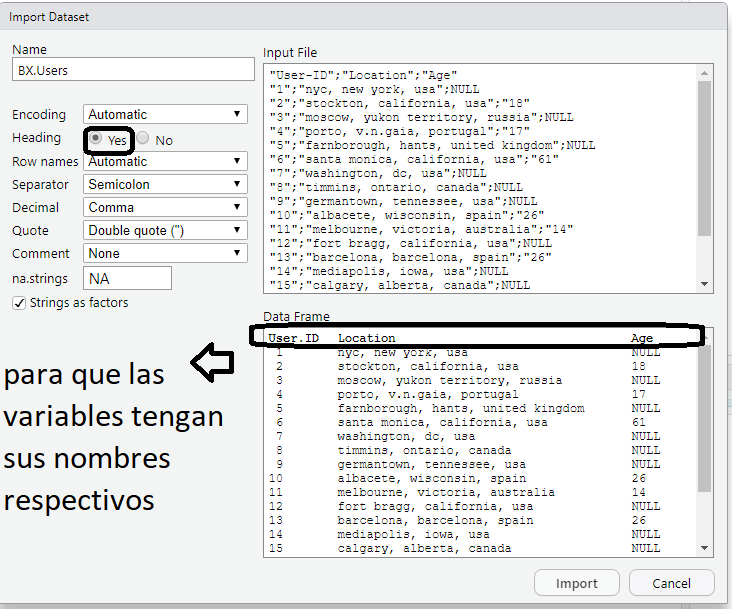
```

De lo contrario se puede ver en la siguiente imagen lo que sucede si ponemos "NO" en donde el encabezado se muestra como una observación más.

```{r echo=FALSE, out.width = "532px", out.height="409px",fig.align='center', fig.cap='Importar data set, parte 2 .`}
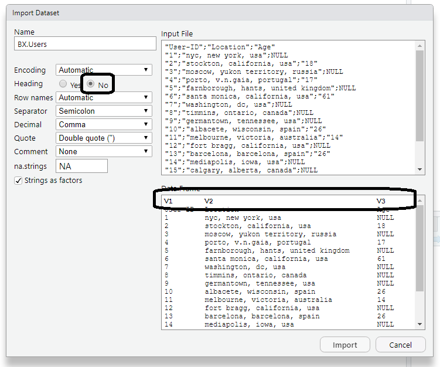
```
Una vez importada la base de datos podemos ver que aparece como Data Frame en la ventana 2, en esta también nos muestra características básicas como la cantidad de observaciones que posee el Data Frame.  También se puede observar en la consola que se importó el archivo correctamente, es recomendable copiar y pegar en el script lo demarcado, así cada vez que queramos trabajar se subirá automáticamente la base de datos. 

```{r echo=FALSE, out.width = "800px", out.height="300px",fig.align='center', fig.cap='Importar data set, parte 3.`}
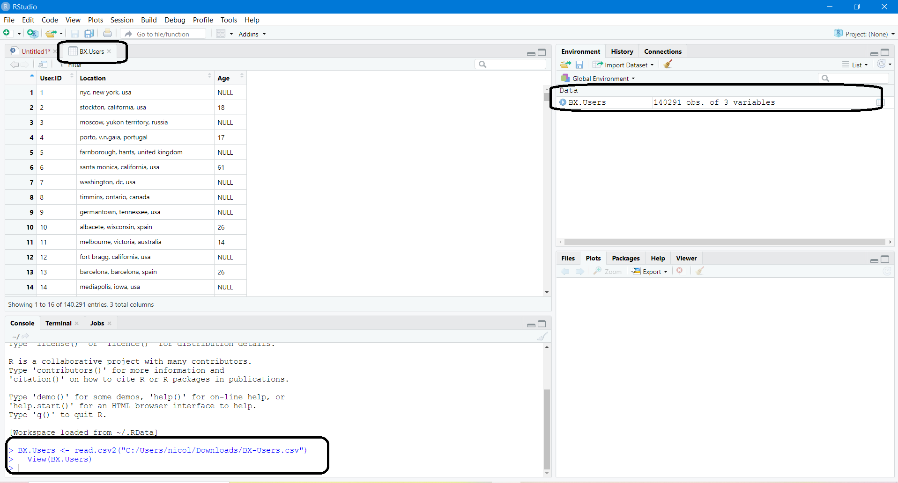
```

### Desde R-cloud 

En cuanto a R-Cloud se suben los archivos un poco diferentes, en este nos tenemos que dirigir la ventana 4 en donde dice **Upload**, esto abrirá una ventana llamada Target directory presionamos donde dice elegir archivo, con esto nos abre otra ventana en donde debemos buscar el archivo que queremos importar. 

```{r echo=FALSE, out.width = "956px", out.height="516px",fig.align='center', fig.cap='Importar desde R-cloud.`}
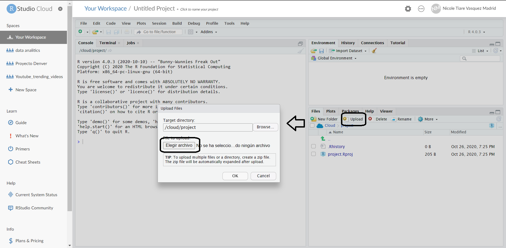
```
 Esto creara un archivo en la ventana 4 como se muestra en la siguiente imagen. Y ahora se procede a realizar la importación del archivo en la segunda ventana como se realiza en R- Studio.
 
```{r echo=FALSE, out.width = "920px", out.height="471px",fig.align='center', fig.cap='Importar desde R-cloud, parte 2.`}
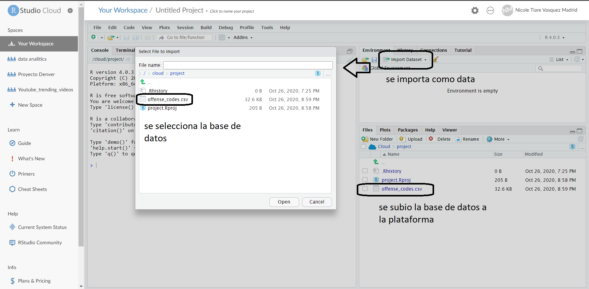
```

## Unir o combinar data frames en R

Cuando se trabaja con grandes cantidades de datos, a veces es necesario combinar bases de datos para consolidarlo en una que contenga toda la información.  En este capítulo veremos diferente forma de realizar datos relacionales, pero primero hay que tener en cuenta la siguiente recomendación: 

* Debes extraer los datos básicos de cada base de datos como: 
+ La cantidad de filas y columnas por cada base de datos. 
+ De qué tipo son las columnas, por ejemplo, si son numéricas o caracter. 
+ Revisar cuidadosamente la visualización de la base de datos para observar si existe algún punto en común entre las bases de datos.
* Debes conocer que representa cada variable de base de datos.
* Luego realiza un diagrama para ver las variables en común. 

Como se observa en la siguiente imagen, tenemos la columna ID esta sería la llave para unir las diferentes bases de datos. 

```{r echo=FALSE, out.width = "920px", out.height="471px",fig.align='center', fig.cap='Combinar data frames en R.`}
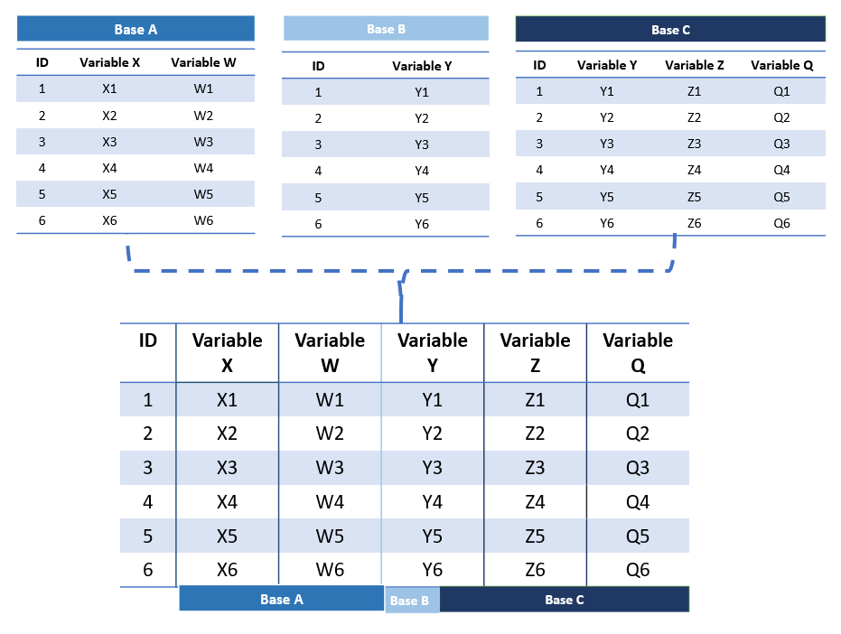
```


En segundo lugar, hay que tener en cuenta las tres familias de verbos diseñados para trabajar con datos relacionales:

* **filtering joins** (Filtrado de combinaciones), que filtran las observaciones de un marco de datos en función de si coinciden o no con una observación de la otra tabla.
* **set operations** (Establecer operaciones), que tratan las observaciones como si fueran elementos establecidos.
*  **mutating joins** (Uniones de trasformación), que agregan nuevas variables a un marco de datos a partir de observaciones coincidentes en otro.

### mutating joins (Uniones de trasformación)

Esta busca combinar variables a partir de dos tablas, en la que busca coincidencias de observaciones de acuerdo con su put y luego copia las variables de una tabla en la otra. Tal como `mutate()`, las funciones de unión agregan variables hacia la derecha, por lo que,  si tienes muchas variables inicialmente, las nuevas variables no se imprimirán.

Una de las uniones más simples es a través de `mage()` para hacer cruces de tablas, como se muestra en la siguiente imagen. 

```{r echo=FALSE, out.width = "775px", out.height="230px",fig.align='center', fig.cap='Ejemplo principal.`}
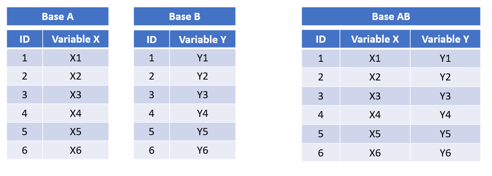
```
Para ello crearemos 2 bases baseA y baseB con una llave o columna en común ID.

```{r, include=FALSE}
#vectores 
A <- c("x1", "x2", "x3", "x4", "x5", "x6")
ID <- c( 1, 2, 3, 4, 5, 6)
B <- c("y1", "y2", "y3", "y4", "y5", "y6")
# data frame
baseA <- data.frame(ID, A)
baseB <- data.frame(ID, B)
```

```{r}
baseA
```

```{r}
baseB
```

Para unir la baseA y en la baseB utilizaremos `merge()` para crear la base AB.

```{r}
baseAB = merge(baseA, baseB, by = "ID")
```

```{r}
baseAB
```

#### Unión interior

La forma más simple de unión es la unión interior (del inglés inner join). Como se muestra en la siguiente imagen:

Pero primero crearemos 3 vectores ID, A y B para luego crear un baseA y baseB.

```{r include=FALSE}
#vectores 
A <- c("x1", "x2", "x3", "x4", "x5", "x6")
ID <- c( 1, 2, 3, 4, 5, 6)
B <- c("y1", "y2", "y3", "y4", "y5", "y6")
# data frame
baseA <- data.frame(ID, A)
baseB <- data.frame(ID, B)
```

A continuación, en vez de crear un base llamada baseAB se concatena la baseA con la baseB para llamarse baseA.

```{r}
baseA %>%
  inner_join(baseB, by = "ID")
```

Como se observas se unieron las baseA y baseB, en una unión interior mantiene las observaciones que aparecen en ambas tablas.

#### Uniones exteriores 

Una unión exterior mantiene las observaciones que aparecen en al menos una de las tablas. Existen tres tipos de uniones exteriores:

* **Una unión izquierda** `left_join()` mantiene todas las observaciones en x.

```{r include=FALSE}
#vectores 
A <- c("x1", "x2", "x3", "x4", "x5", "x6")
ID <- c( 1, 2, 3, 4, 5, 6)
B <- c("y1", "y2", "y4", "y5", "y6")
ID1 <-c(1, 2, 4, 5, 6)
# data frame
baseA <- data.frame(ID, A)
baseB <- data.frame(ID1, B)
names (baseB)[1] = "ID"
```

```{r echo=FALSE, out.width = "775px", out.height="230px",fig.align='center', fig.cap='Ejemplo, left_join .`}
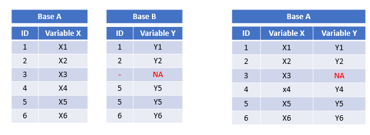
```
```{r}
baseA %>%
  left_join(baseB, by = "ID")
```


* **Una unión derecha** `right_join()` mantiene todas las observaciones en y.
```{r include=FALSE}
#vectores 
A <- c("x1", "x2", "x3", "x5", "x6")
ID <- c( 1, 2, 3, 5, 6)
B <- c("y1", "y2", "y3", "y4", "y5", "y6")
ID1 <-c(1, 2, 3, 4, 5, 6)
# data frame
baseA <- data.frame(ID, A)
baseB <- data.frame(ID1, B)
names (baseB)[1] = "ID"
```

```{r echo=FALSE, out.width = "775px", out.height="230px",fig.align='center', fig.cap='Ejemplo, right_join .` }
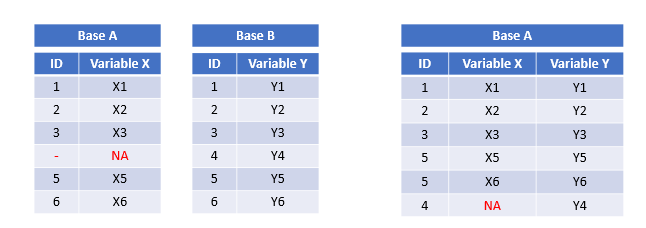
```


```{r}
baseA %>%
  right_join(baseB, by = "ID")
```

* **Una unión completa** `full_join()` mantiene todas las observaciones en x e y.
observaciones en y.

```{r include=FALSE}
#vectores 
A <- c("x1", "x2", "x4", "x5", "x6")
ID <- c( 1, 2, 4, 5, 6)
B <- c("y1", "y2", "y3", "y4", "y6")
ID1 <-c(1, 2, 3, 4, 6)
# data frame
baseA <- data.frame(ID, A)
baseB <- data.frame(ID1, B)
names (baseB)[1] = "ID"
```

```{r echo=FALSE, out.width = "775px", out.height="230px",fig.align='center', fig.cap='Ejemplo, full_join .`}
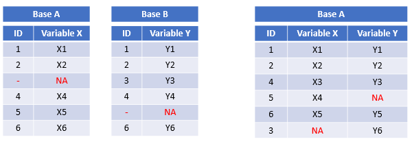
```


```{r}
baseA %>%
  full_join(baseB, by = "ID")
```

#### claves (llave) duplicadas.

Pero que sucede si la ID esta duplicada ¿cómo podemos unirlas? para ellos nos pondremos en dos escenarios diferentes. 


* El primero en tabla que tiene claves duplicadas. Esto es útil cuando quieres agregar información adicional dado que típicamente existe una relación "uno a muchos".

```{r include=FALSE}
#vectores 
A <- c("x1", "x2", "x3", "x4")
ID <- c( 1, 2, 1, 2)
B <- c("y1", "y2")
ID1 <-c(1, 2)
# data frame
baseA <- data.frame(ID, A)
baseB <- data.frame(ID1, B)
names (baseB)[1] = "ID"
```

```{r echo=FALSE, out.width = "775px", out.height="230px",fig.align='center', fig.cap='Ejemplo, claves duplicadas.`}
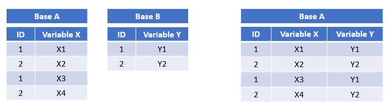
```


```{r}
baseA %>%
  left_join(baseB, by = "ID")
```

* Ambas tablas tienen claves duplicadas. Esto es usualmente un error debido a que en ninguna de las tablas las claves identifican de manera única una observación. Cuando unes claves duplicadas, se obtienen todas las posibles combinaciones, es decir, el producto cartesiano:

```{r include=FALSE}
#vectores 
A <- c("x1", "x2", "x3", "x4")
ID <- c( 1, 2, 2, 3)
B <- c("y1", "y2", "y3", "y4")
ID1 <-c(1, 2, 2, 3)
# data frame
baseA <- data.frame(ID, A)
baseB <- data.frame(ID1, B)
names (baseB)[1] = "ID"
```

```{r echo=FALSE, out.width = "775px", out.height="230px",fig.align='center', fig.cap='Ejemplo, claves duplicadas 2.`}
knitr::include_graphics("static/img/imagen5.3.1.3(2).png")
```

```{r}
baseA %>%
  left_join(baseB, by = "ID")
```

#### otras formas 

con **dplyr** | con **merge** |
--------------|---------------|
`inner_join(base1, base2)` |` merge(base1, base2)`|
`full_join(base1, base2)` | `merge(base1, base2, all.x = TRUE, all.y = TRUE)` |
`right_join(base1, base2)` |` merge(base1, base2, all.y = TRUE)` |
`left_join(base1, base2)` |` merge(base1, base2, all.x = TRUE)` |

La ventaja de los verbos específicos de la libreria dplyr es que muestran de manera clara la intención del código: la diferencia entre las uniones es realmente importante, pero se esconde en los argumentos de `merge()`. Las uniones de dplyr son considerablemente más rápidas y no generan problemas con el orden de las filas.

Si las variables clave tiene diferente nombre (solo cosas en común)

`merge(base1, base2, by.x="nombre variable base 1", by.y="nombre variable base 2")`

Si la variable se llama igual en las dos bases (solo cosas en común) 

`merge(base1, base2, by="nombre variable")`

Si queremos que se unan todos los casos

`all=TRUE: merge(base1, base2, by="nombre variable", all=TRUE)`

Si queremos unir por más de una variable: (si las variables se llaman igual en ambas bases)

`merge(base1, base2, by=c("variable1", "variable2"))` 

Si las variables se llaman diferente en ambas bases

`merge(base1, base2, by.x=c("variable1", "variable2"), by.y=c("variable1", "variable2"))`

Otras formas efectivas de realizar una unión de base son los siguientes códigos. 

### Uniones de filtros

Las uniones de filtro unen observaciones de la misma forma que las uniones de transformación, pero afectan a las observaciones no a las variables. Existen dos tipos:

* `semi_join(x, y)` mantiene todas las observaciones en x con coincidencias en y.

```{r include=FALSE}
#vectores 
A <- c("x1", "x2", "x3", "x4", "x5")
ID <- c( 1, 2, 3, 4, 5)
B <- c("y1", "y2", "y4", "y5")
ID1 <-c(1, 2, 4, 5)
# data frame
baseA <- data.frame(ID, A)
baseB <- data.frame(ID1, B)
names (baseB)[1] = "ID"
```

```{r echo=FALSE, out.width = "775px", out.height="230px",fig.align='center'}
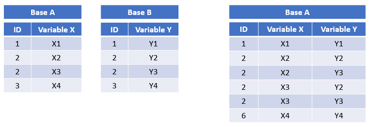
```


```{r}
baseA %>%
  semi_join(baseB)
```

* `anti_join(x, y)` descarta todas las observaciones en x con coincidencias en y.


```{r include=FALSE}
#vectores 
A <- c("x1", "x2", "x3", "x4", "x5")
ID <- c( 1, 2, 3, 4, 5)
B <- c("y1", "y2", "y4", "y5")
ID1 <-c(1, 2, 4, 5)
# data frame
baseA <- data.frame(ID, A)
baseB <- data.frame(ID1, B)
names (baseB)[1] = "ID"
```

```{r echo=FALSE, out.width = "775px", out.height="230px",fig.align='center', fig.cap='Ejemplo, anti_join.`}
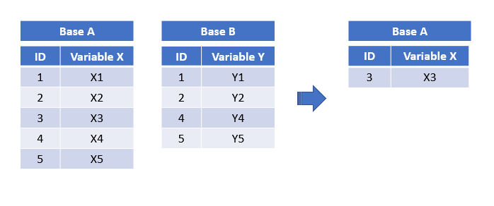
```

```{r}
baseA %>%
  anti_join(baseB)
```

Las semi uniones son útiles para unir tablas resumen previamente filtradas con las filas originales. 

## Exploración de la data 

Ahora realizaremos una exploración de la base de datos, en este caso usaremos la base de datos disponibles llamado `AB_NYC_2019.csv`, que se encuentra disponible en el siguiente link:
https://www.kaggle.com/dgomonov/new-york-city-airbnb-open-data

Pero primero necesitamos la siguientes Liberia:
```{r}
library(dplyr)
library(tidyr) 
library(readxl)
```

Importamos la base de datos a R-Studio como se vio en capítulos anteriores. 

```{r}
airbnb <- read.csv("static/img/AB_NYC_2019.csv")
```


### Inspección de una tabla

Luego realizamos la visualización de la data. 

```{r eval=FALSE}
airbnb
```

```{r echo=FALSE}
library(DT)
datatable(airbnb)
```

Ahora realizaremos una breve descripción de las columnas de la data: 

Variable | Descripción|
:--------|:----------|
id | Código de hostal |
name | Nombre de Airbnb |
host_id | Código de Airbnb |
host_name | Nombre del anfitrión |
neighbourhood_group | Distritos de new york |
neighbourhood | Vecindarios de los distritos |
latitude | Coordenada latitud |
longitude | Coordenada de longitud |
room_type | Tipo de habitación |
price | Precio |
minimum_nights | Cantidad mínima de noches para una reserva |
number_of_reviews | Numero de revisiones por mes |
last_review | Ultimas reseña |
reviews_per_month | Cantidad de comentarios por mes para la propiedad |
calculated_host_listings_count | Numero de anuncios |
availability_365 | Número de días en los que la lista está disponible para la reserva. |

Para obtener más información revisamos a través de los códigos como lo siguientes:

Queremos determinar si la base de datos posee algún problema usamos función `problems()`.

```{r}
problems(airbnb)
```

Para ver la cantidad de observaciones usaremos la función `nrow()`.
```{r}
nrow(airbnb)
```
Cuantas columnas o variables poseen la data con la función `ncol()`. 
```{r}
ncol(airbnb)
```
si queremos ver las primeras observaciones usamos la función `head()`.
```{r}
head(airbnb) # primeras seis filas
```
```{r}
tail(airbnb) # últimas seis filas
```
Si queremos saber los nombres de las columnas o variables se usa la función `colnames()`
```{r}
colnames(airbnb)
```

### Selección de filas y columnas

A veces queremos trabajar con un subconjunto de la tabla, como por ejemplo una selección de filas y/o columnas. Para este tipo de selecciones se usa el corchete `[]`.

```{r eval=FALSE}
airbnb[1:5, ] # las 5 primeras filas 
```

```{r echo=FALSE}
library(DT)
datatable(airbnb[1:5, ])
```

```{r eval=FALSE}
airbnb[,3:4] # las 5 primeras filas 
```

```{r echo=FALSE}
library(DT)
datatable(airbnb[,3:4])
```
Como se observó los corchetes tienen dos partes separadas por una coma la que la precede se refiere a las filas que se encuentra a las izquierdas de la coma y a la derecha las columnas. Pero no es necesario conocer índice de una determinada columna para seleccionarla, ya que los corchetes se pueden utilizar poniendo el nombre de la columna como se ve a continuación. 
 
```{r}
airbnb[1:4,"id"]
```
si queremos extraer y operar sobre columnas individuales de una tabla se utiliza el signo $.

```{r eval=FALSE}
airbnb$id # las 5 primeras filas 
```


Ahora con la función `str()` veremos cómo están compuestas las columnas si son numéricas o factor, como también veremos la cantidad de variables y observaciones que posee la data.  

```{r}
str(airbnb)
```
Podemos observar a grandes rasgos que las variables room_type posee 3 niveles, que existe datos vacíos NA en la variable reviews_per_month  y que neighbourhood  posee 221 niveles.  

###Tratamiento de observaciones NA 

Ahora veremos si existen datos vacíos en la data con la función `sapply()` y para buscar los datos vacíos en se utiliza `is.na()`.
```{r}
sapply(airbnb, function(airbnb) sum(is.na(airbnb)))
```

Observamos que en las variables reviews_per_month posee 10052 datos vacíos y para ver los datos vacíos es lo mismo, pero con `is.null()`.

```{r}
sapply(airbnb, function(airbnb) sum(is.null(airbnb)))
```

No existe datos nulos en la data como se puede observar. Ahora para eliminar los datos vacíos observados anteriormente.

#### Eliminar las observaciones NA en r studio

```{r}
airbnb <- airbnb[!is.na(airbnb$reviews_per_month),] 
```

Veremos si las observaciones fueron eliminadas. 
```{r}
nrow(airbnb)
```

### Exploración de las variables

Realizaremos la exploración de la variable ID, lo primero que veremos es si los datos de esta variable son datos únicos, para ello crearemos la data ID y usaremos la función `select()` que nos ayudara seleccionar la base y las variables que deseamos observar, y además utilizaremos la función `unique()` para ver si son únicas en su valor.

```{r}
id <- select(airbnb, id) %>% unique
nrow(id)
```

La data tiene 48895 datos y la columna ID igual por lo que no existen datos repetidos. Con la variable name veremos si existen datos vacíos en la data y cual es ID de estos datos vacíos.

```{r}
airbnb%>% 
  select(id, name)%>% 
  filter (is.na (name))
```

No existe datos vacíos. Ahora siguiéremos saber el nombre especifico de un ID, usaremos el mismo código anterior, pero en la función `filter()` colocamos ID == que representa el igual y el ID que deseamos buscar en este caso es el 2232600.

```{r}
airbnb%>% 
  select(id, name)%>% 
  filter (id == "2232600")
```

#### Remplazar observaciones

Como observamos no existe nombre, esto demuestra que a veces es bueno realizar más de una revisión. Para solucionar estos problemas remplazaremos los datos en blanco por No . 

```{r}
airbnb$name[airbnb$name == ""] <- "No"
```
```{r}
airbnb%>% 
  select(id, name)%>%
  filter(is.na (name))
```

Antes de eliminarlo tenemos que ver si estos datos son relevantes para nuestro estudio y si esas variables la utilizaremos más adelante.

```{r}
airbnb$host_name[airbnb$host_name == ""] <- "No"
```

Ahora veremos la variable neighbourhood_group y cuales son los niveles de esta variable. 

```{r}
neighbourhood_group <- select(airbnb, neighbourhood_group) %>% unique 
neighbourhood_group
```

Con la variable price veremos el promedio, máximo, varianza y mínimo.

```{r}
summarise(airbnb, mean = mean(price), variance = var(price), min = min(price), max = max(price))
```

El mínimo es 0 por que existen hospedaje con "precio 0" esto es ilógico para una empresa por lo que se busca identificar cuáles son estos datos.

```{r}
airbnb%>% 
  select(id, price)%>% 
  filter (price == "0")
```

Son 10 datos y como los ID son datos únicos se entiende que estos datos no se repitieran. esta columna es relevante por lo que se elimina los 11 datos nulos.

```{r}
airbnb <-airbnb [airbnb$price!="0",] #elimina los 0
summarise(airbnb, mean = mean(price), variance = var(price), min = min(price), max = max(price))
```

Con la variable minimum_nights.

```{r}
summarise(airbnb, mean = mean(minimum_nights), variance = var(minimum_nights), min = min(minimum_nights), max = max(minimum_nights))
```

Existen máximos con más de 365 días por lo que se determina que no es coherente en consecuencia se eliminan las celdas mayores a 365.

```{r}
nrow(filter(airbnb, minimum_nights>=366))
```
cuando queremos eliminar observaciones especificas utilizamos el siguiente código.
```{r}
airbnb<-airbnb[!(airbnb$minimum_nights %in% c("999","370","1000","1250","500","480","500","999","500","366","999","400","990","500")),]
```

Se eliminan para no afectar la data y verificamos.

```{r}
summarise(airbnb, mean = mean(minimum_nights), variance = var(minimum_nights), min = min(minimum_nights), max = max(minimum_nights))
```

Ahora veremos la variable number_of_reviews.
```{r}
summarise(airbnb, mean = mean(number_of_reviews), variance = var(number_of_reviews), min = min(number_of_reviews), max = max(number_of_reviews))
```
 

<div/>
