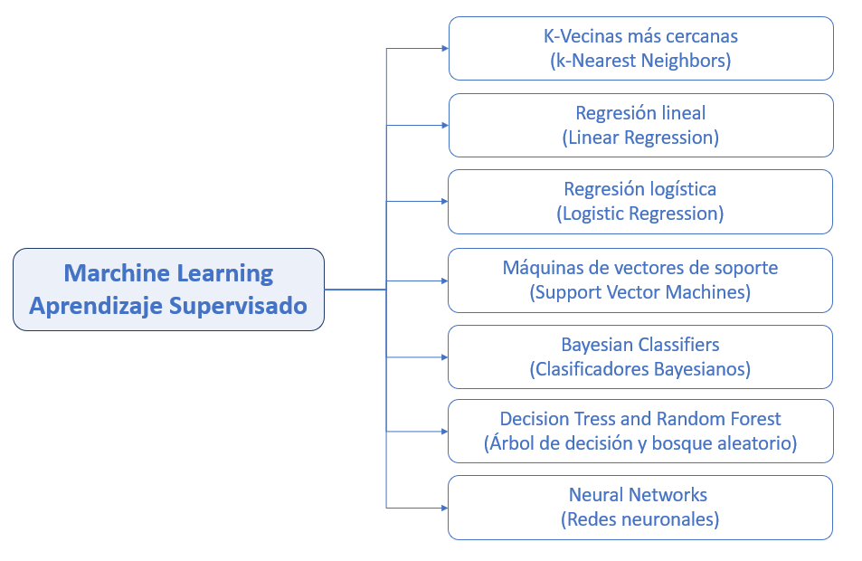
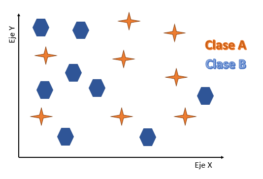
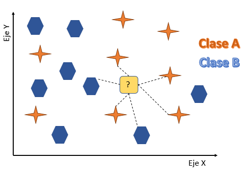
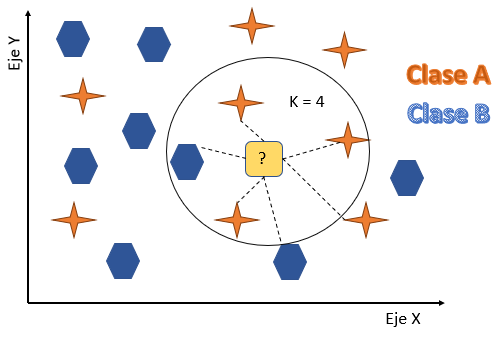
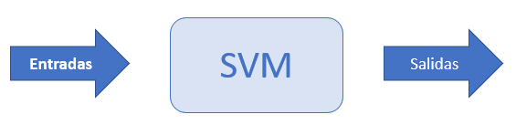

title: "Machine Learning"
output:
  html_document:
    df_print: paged
---

# Machine Learning
<div style="text-align: justify">

Machine Learning o también conocido como Aprendizaje automático es una rama de la inteligencia artificial, que tiene como objetivo desarrollar técnicas que permitan que las computadoras aprendan, en otras palabras, es la capacidad de una máquina o software para aprender mediante algoritmos de su programación respecto a cierta entrada de datos en su sistema.

Un sistema informático de Machine Lenarning (ML) utiliza la experiencias y evidencias en forma de datos a partir de un gran número de ejemplos de una situación, con los que obtiene por sí mismo patrones o comportamientos. De este modo, se pueden elaborar predicciones en diferentes escenarios o iniciar operaciones que son la solución para una tarea específica.

El Machine Lenarning (ML) posee dos diferentes tipos el Aprendizaje Supervisado y No Supervisado, que veremos con más detalle a continuación. 


## Algoritmo Supervisados

**Los modelos de aprendizajes supervisados** es una técnica para deducir una función a partir de datos de entrenamiento, en donde el entrenamiento actúa como una guía para enseñar al algoritmo los resultados a las que debe llegar, es decir la salida del algoritmo ya es conocida. Esto requiere que los posibles resultados del algoritmo ya sean conocidos y que los datos utilizados para entrenar el algoritmo ya estén etiquetados “labels” con las respuestas correctas. Un ejemplo es la clasificación de los correos entrante entre Spam o no. Entre las diversas características que queremos entrenar deberemos incluir si es correo basura o no con un 1 o un 0.  Otro ejemplo es si queremos predecir unos valores numéricos como el precio de vivienda a partir de sus características.

Es importante tener en cuenta lo siguiente; se consideran como un modelo de regresión, si la salida es un valor de un espacio continuo y de lo contrario si la salida es un valor categórico (por ejemplo, una enumeración, o un conjunto finito de clases) se considerará un modelo de clasificación, en otras palabras, cuando la variable sea discreta los llamaremos clasificación. En la siguiente imagen se muestra los diferentes tipos de algoritmos supervisados: 

```{r echo=FALSE, out.width = "953px", out.height="620px",fig.align='center'}

```


### Vecinos cercanos (KNN)

 K-Nearest-Neighbor (Vecinos cercanos) es un método que busca en las observaciones más cercanas a la que se está tratando de predecir y clasifica el punto de interés basado en la mayoría de los datos que le rodean. Por ejemplo, Imaginemos que tenemos dos variables como input y como output nos da si es Clase A(naranjo) o Clase B (azul). Esta data es nuestra data de entrenamiento.


```{r echo=FALSE, out.width = "534px", out.height="364px",fig.align='center'}

```

Una vez que tenemos nuestra data de entrenamiento empezaremos a usar la data de test. Ahora como queremos predecir la clase “output”, veremos cómo uno de estos datos se vería visualmente y lo pintaremos de color amarillo. Para ello a continuación, calculamos la distancia entre este punto y los demás datos.

```{r echo=FALSE, out.width = "534px", out.height="364px",fig.align='center'}

```

Hemos trazado solo algunas distancias, pero podríamos hacerlo con todos. Para este ejemplo tomaremos los k = 4 vecinos más cercanos.

```{r echo=FALSE, out.width = "534px", out.height="364px",fig.align='center'}

```

Podemos observar que si nos enfocamos solo en los 3 vecinos más cercanos hay más naranjos que azules, entonces nuestra predicción será que este punto (demarcado con ”?”) ha de ser clase naranja.

Al calcular la distancia en un plano cartesiano es podría ser más sencillo, solo tenemos variables como input: en el eje x y eje y. Sin embargo, la misma lógica se puede llevar a más variables.

Ahora veremos lo anterior en el caso de múltiples variables con la data data frame **iris**. El famoso conjunto de datos de Ronald Fisher, que se encuentra incluido en todas las instalaciones de R.  

El dataset **Iris** se compone de 150 observaciones de flores de la planta iris. La cual existen tres tipos de clases de flores iris: virginica, setosa y versicolor(Hay 50 observaciones de cada una).
Las variables o atributos que se miden de cada flor son:

* El tipo de flor como variable categórica. 
* El largo y el ancho del pétalo en cm como variables numéricas. 
* El largo y el ancho del sépalo en cm como variables numéricas.


```{r echo=FALSE, out.width = "634px", out.height="264px",fig.align='center'}
knitr::include_graphics("static/img/imagen6.1.png")
```

#### Requisitos

```{r eval=FALSE}
install.packages("mlr", dependencies = TRUE)
install.packages("datasets")
install.packages("tidyverse")
install.packages("XML", repos = "http://www.omegahat.net/R")


```
```{r message=FALSE}
#Bibliotecas
library(datasets)
library(tidyverse)
library(mlr)
library(XML)
```

Una vez instalada las librerías, se procede a llamar la base de datos **iris**, para luego ver a través del código `str()`  las variables que la componen.

#### Analizar el dataset IRIS


```{r eval=FALSE}
iris
```

```{r echo=FALSE}
library(DT)
datatable(iris)
```


```{r}
str(iris)
```
 Se observa que posee 5 columnas de las cuales 4 son numéricas y una pertenece a una variable factor que corresponde a la especie, esta posee 3 niveles diferentes. para luego crear un as_tibble llamado **iristib** con la función `as_tibble()` que convierte un objeto existente, como un marco de datos o una matriz, en un llamado tibble, un marco de datos con clase **tbl_df**.

```{r}
irisTib <- as_tibble(iris)
```

Luego se realiza una `summary()` para ver la media, máxima, mínima etc. Estos nos sirves para ver si extiende datos fuera de rango o datos que ensucie la data.

```{r}
summary(irisTib)
```

Es importante tener en cuenta de que la base de datos debe estar balanceada, en el caso de dataset de iris esta se encuentra balanceada, ya que poseemos de 50 observaciones de cada especie, esto se realiza para tener mejor rendimiento del modelo. Y si se presenta el caso de que la base de datos no se encuentra balanceada, esta se debe balacear tomado cantidades de observaciones iguales de cada tipo de la variable que se utilizara como variable dependiente. 

#### Visualizamos la data

Veremos los datos con un gráfico para ver cómo se comportan los datos. 

```{r}
ggplot(irisTib, aes(Sepal.Width, Sepal.Length, col=Species )) +
  geom_point()  +
  theme_bw()


```

realizamos un agrupar elementos por colores

```{r}
ggplot(irisTib, aes(Petal.Length, Petal.Width, col=Species)) +
  geom_point()  +
  theme_bw()
```

Se puede observar que entre las especies presentan distintas asociaciones, una forma rápida de visualizarlo es coloreando los puntos según el nivel del factor Species. Además, los datos presentan una estructura de asociación entre el largo de los sépalos y el de los pétalos es decir que a mayor largo de sépalos, mayor largo de pétalos. 

#### Crear el clasificador

```{r}
irisTask <- makeClassifTask(id="iris", data = irisTib, target = "Species")
irisTask

```
#### Entrenamiento y pruebas

Un modelo generalmente se entrena en un subconjunto de datos, y el resto de la data se utiliza para evaluar su desempeño.

```{r}
n=getTaskSize(irisTask)
n

```

Primero obtenemos a través de `getTaskSize()`  el número de observaciones en la tarea. En este caso n = 150.

```{r}
ratio=3/4
```

Luego llamaremos `set.seed()` para que estos resultados sean replicables. Esto es para generar números aleatorios replicables.

```{r}
set.seed(1234)
train = sample(1:n, n*ratio)
train
```

Revisamos la compasión de **train** y podemos ver que está compuesto por números enteros y son 112 observaciones.

```{r}
str(train)
```
Para luego calcular la diferencia de conjuntos (no simétricos) de subconjuntos de un espacio de probabilidad.

```{r}
test = setdiff(1:n, train)
test
```

#### Determinamos el Clasificador
Es impórtate tener en cuenta antes de escoger el clasificador la siguiente tabla que muestra los tipos de classif existen. 

clase | paquete | Num | Fac | Ord | Nas | Pesos | Soporta |    
------|:------:|:-----:|:---:|:-----:|:-----:|:-----:|:------|
`classif.kknn` | kknn | x | x |  |  |   |  prob, dos clase, clase multiclase | 
`classif.knn` | clase | x |  |  |  |  | 	 dos clase, multiclase |

Por ejemplo, si tenemos un data que posee tantos variables numéricas y factor usaremos el clasificador `classif.kknn` , pero si es caso de que nuestras variables son numéricas usaremos el clasificador `classif.knn`.

Según las características de nuestra base de datos Iris usaremos classif.knn. Crearemos un clasificador que busque los 3 más cercanos al punto con K =3, esto lo hacemos con `makeLearner("classif.knn", k = 3)`. Se debe Tener en cuenta que `classif.knn` se llama desde el classpaquete a través de mlr. 

```{r}

knn = makeLearner("classif.knn", k=3)
knn
```

Luego creamos el modelo con el dataset de entrenamiento con `train()` primero colocamos en clasificador creado `knn`, luego usamos `iristask` y por último `train` que fue creado anteriormente.

```{r}
mod = train(knn, irisTask, subset = train)
mod
```
Podemos ver que tenemos 112 observaciones con 4 variables con un valor de k=3.

#### Predicciones

```{r}
preds = predict(mod, irisTask, subset = test)

```

```{r}
preds
```

**Evaluemos las predicciones**

Se calcula varias medidas de rendimiento a la vez como: 
 * `acc`: define la precisión general como la probabilidad de correspondencia entre una decisión positiva y una condición verdadera (es decir, la proporción de decisiones de clasificación correctas o de casos).
 * `mmce`(Error medio de clasificación errónea).

```{r}
ms = list("mmce" = mmce, "acc" = acc, "timetrain" = timetrain)
```

La función `performance()` mide la calidad de una predicción y está compuesta por los siguientes argumentos; `pred` como el objeto de predicción; `measures` es la Medida(s) de rendimiento a evaluar, es decir  el valor predeterminado es la medida predeterminada para la tarea; `task` es la tarea de aprendizaje, podría solicitarse por medida de rendimiento, por lo general no es necesario, excepto para la agrupación en clústeres o la supervivencia; `model` Modelo basado en datos de entrenamiento, podría solicitarse por medida de rendimiento, por lo general no es necesario, excepto para la supervivencia.


```{r}
performance(preds, measures = ms, task = irisTask, mod)

```

 Con un error de clasificación errónea media de 0.1052632 (el más bajo) y acc de 0.8947368.

#### Matriz de confusión

Ahora realizaremos una matriz de confusión, para ver cuántos valores predichos fueron iguales a los reales utilizando la función `calculateConfusionMatrix()`. Esta función nos permite visualizar el rendimiento de un algoritmo, usado generalmente en un aprendizaje supervisado (en cuanto aprendizaje no supervisado generalmente se denomina matriz coincidente). Como se observa en el siguiente código cada fila de la matriz representa las instancias en una clase predicha, mientras que cada columna representa las instancias en una clase real (o viceversa). El nombre se deriva del hecho de que hace que sea fácil ver si el sistema confunde dos clases (etiquetar incorrectamente una como otra).

```{r}

calculateConfusionMatrix(preds, relative = FALSE)
```

Interpretemos celda a celda este resultado:

* El modelo kNN predijo 15 valores como especie “setosa” y resulta que en nuestra prueba el valor real, output era también setosa.
* Además el modelo predijo 12 como especie versicolor. Sin embargo, en la data real-test, de esos 12, solo 11 son versicolor y 1 son virginica.
* El modelo predijo 12 como especie virginica. Sin embargo, en la data real-test, de esos 16, solo 8 son virginica y 3 versicolor.

### Regresiones logística

Es un método estadístico para predecir clases binarias, el resultado es llamado como variable objetivo y es de naturaleza dicotómica, esto quiere decir que solo hay dos clases posibles. La Regresión Logística es uno de los algoritmos de Machine Learning más simples y utilizados para la clasificación de dos clases, esta describe y estima la relación entre una variable binaria dependiente y las variables independientes.

#### requisitos
```{r eval= FALSE}
install.packages("mlr", dependencies = TRUE)
install.packages("datasets")
install.packages("tidyverse")
install.packages("kernlab")
install.packages("XML", repos = "http://www.omegahat.net/R")

library(mlr)
library(tidyverse)
```
#### Analizar el dataset titanic

Queremos saber si los factores socioeconómicos influyeron en la probabilidad de una persona de sobrevivir al desastre. Por lo tanto, el objetivo es construir un modelo de regresión logística binomial para predecir si un pasajero sobreviví al desastre del Titanic, según datos como su género y cómo Cuánto pagaron por su boleto. 

A continuación, instalaremos la base de datos del Titanic .
```{r eval= FALSE}
install.packages("titanic")

```

```{r}
data(titanic_train, package = "titanic")
```

Ahora carguemos los datos, que están integrados en el paquete Titanic, convertiremos la base con la función `as_tibble ()`.

```{r}
titanicTib <- as_tibble(titanic_train)
```

Ahora veremos la visualización de la data Titanic.

```{r echo=FALSE}
library(DT)
datatable(titanicTib)
```

Tenemos un tibble que contiene 891 casos (observaciones) y que contiene 12 variables. El objetivo de realizar este modelo es para predecir si un pasajero tiene posibilidad de sobrevivir al desastre utilizando la información en estas variables. 


```{r}
str(titanicTib)
```
la base contiene las siguientes variables:

**Variable** | **descripción **|
---------|--------------|
PassengerId | Un número arbitrario único para cada pasajero. |
Sobrevivido| Un número entero que denota supervivencia (1 = sobrevivió, 0 = murió) |
Pclass| Si el pasajero estaba alojado en primera, segunda o tercera clase|
|Nombre| Un vector de caracteres de los nombres de los pasajeros|
|Sexo| Un vector de caracteres que contiene "masculino" y "femenino"|
 Edad| La edad del pasajero|
 SibSp| El número combinado de hermanos y cónyuges a bordo|
Parch| El número combinado de padres e hijos a bordo|
 Boleto| Un vector de caracteres con el número de boleto de cada pasajero|
arifa| La cantidad de dinero que cada pasajero pagó por su boleto|
Cabina| Un vector de caracteres del número de cabina de cada pasajero|
Embarked | Un vector de caracteres del que los pasajeros del puerto se embarcaron|

**Convertir datos a factores **

Ahora necesitamos limpiar la data antes de que podamos pasarlo al algoritmo de regresión logística. Lo primero que haremos es cambiar las variables Survived, Sex y Pclass a factor como se muestra a continuación. 

```{r}
fctrs <- c("Survived", "Sex", "Pclass")
```

Para convertirlas usaremos función `mutate_at()`, que nos permite mutar varios factores a la vez. Suministramos las variables existentes como vector de caracteres al argumento `.vars` que en este caso es la anterior base creada con las columna llamada `fctrs`y para luego utilizar el argumento `.funs` para que las trasforme a factor.

Posteriormente utilizamos la función `mutate()`  para poder crear una nueva variable llamada FamSize que sería la suma SibSp (el número combinado de hermanos y cónyuges a bordo) y Parch (el número combinado de padres e hijos a bordo). Para finalizar con la función `select()` el cual nos ayuda a seleccionar solo las variables que creemos pueden tener algún valor predictivo para nuestro modelo, las cuales son las variables Survived, Pclass, Sex, Age, Fare y FamSize.


```{r}
titanicClean <- titanicTib %>%
  mutate_at(.vars = fctrs, .funs = factor) %>%
  mutate(FamSize = SibSp + Parch) %>%
  select(Survived, Pclass, Sex, Age, Fare, FamSize)
```

Ahora visualizamos el cambio realizado anteriormente. 

```{r echo=FALSE}
library(DT)
datatable(titanicClean)
```
 Y utilizamos `str()` para ver cómo están constituidas las variables de la data, y como se observas las variables cambiaron a factor .
 
```{r}
str(titanicClean)
```
 Además, tenemos nuestra nueva variable, FamSize y hemos eliminado las variables irrelevantes.

#### Graficamos algunos datos  

Ahora para poder graficar usaremos los siguientes códigos. 

```{r}
titanicUntidy <- gather(titanicClean, key = "Variable", value = "Value", -Survived)

```

```{r echo=FALSE}

datatable(titanicUntidy )
```

```{r}
titanicUntidy %>%
  filter(Variable != "Pclass" & Variable != "Sex") %>%
  ggplot(aes(Survived, as.numeric(Value))) +
  facet_wrap(~ Variable, scales = "free_y") +
  geom_violin(draw_quantiles = c(0.25, 0.5, 0.75)) +
  theme_bw()
```

```{r}
titanicUntidy %>%
  filter(Variable == "Pclass" | Variable == "Sex") %>%
  ggplot(aes(Value, fill = Survived)) +
  facet_wrap(~ Variable, scales = "free_x") +
  geom_bar(position = "fill") +
  theme_bw()

```

Si desea imputar NA's todas las características de números enteros por la media.


```{r}
imp <- impute(titanicClean, cols = list(Age = imputeMean()))

```


`impute()` devuelve una `list()` que contiene el conjunto de datos imputados. Esto quiere decir de de la anterior data set `titanicClean` cambian los datos vacíos por el promedio de las edades para no afectar al a data. 

Crear una tarea De clasificación en la cual la tarea encapsula los datos y específica, a través de sus subclases, el tipo de tarea que en este caso es de clasificación usaremos la función `makeClassifTask`. Para la clasificación de etiquetas múltiples, asumimos que la presencia de etiquetas se codifica mediante columnas lógicas en data. El nombre de la columna especifica el nombre de la etiqueta. `target` .

```{r}
titanicTask <- makeClassifTask(data = imp$data, target = "Survived")
```

Ahora verificamos si los cambios realizados anteriormente fueron realizados. 

```{r}
imp$data$Age
```


```{r}
titanicTask
```

Podemos observar que hay 5 variables de las cuales 3 son numéricas y dos son factor, también podemos observar que la data no presenta ningún dato vacío o perdido. A continuación se crea el modelo logístico, la base de data la llamaremos `logReg` .

```{r}
logReg <- makeLearner("classif.logreg", predict.type = "prob")
```

#### Entrenamos el modelo
Para extraer los parámetros del modelo, primero debemos convertir nuestro mlr objeto modelo, logRegModel, en un objeto modelo usando `getLearnerModel ()`. A continuación, pasamos este objeto de modelo como argumento de la función `coef ()`, que significa coeficientes (otro término para parámetros), por lo que esta función devuelve los parámetros del modelo.

```{r}

logRegModel <- train(logReg, titanicTask)

logRegModel
```

Podemos ver que la data posee 891 observaciones y 5 variables diferentes, y que el tipo de clasificador que se utilizara en este caso es el de `classif.logreg` .

#### Validamos la precisión del modelo

La función `makeImputeWrapper ()` envuelve a un alumno y un método de imputación.Usaremos `"classif.logreg"` por cómo está constituida la data lo que se explica más adelante .


```{r}
logRegWrapper <- makeImputeWrapper("classif.logreg", cols = list(Age = imputeMean()))

```


```{r}
kFold <- makeResampleDesc(method = "RepCV", folds = 10, reps = 50, stratify = TRUE)
```

Ahora apliquemos una validación cruzada estratificada de diez veces, repetida 50 veces, a nuestro paquete aprendiz. Porque estamos proporcionando nuestro alumno empaquetado a la función `resample ()`, para cada pliegue de la validación cruzada, la media de la variable Edad en el conjunto de entrenamiento será utilizado para imputar los valores perdidos.
```{r message=FALSE}
logRegwithImpute <- resample(logRegWrapper, titanicTask, resampling = kFold, measures = list(acc, fpr, fnr))


```

Como se trata de un problema de clasificación de dos clases, tenemos acceso a algunos resultados adicionales métricas, como la tasa de falsos positivos (fpr) y la tasa de falsos negativos (fnr). Podemos ver que, aunque en promedio entre las repeticiones, el modelo clasificó correctamente al 79,6% de los pasajeros, clasificó incorrectamente 29,9% de los pasajeros que murieron y los pasó como sobrevivientes (falsos positivos) e incorrectamente clasificaron al 14,4% de los pasajeros que sobrevivieron como muertos (falsos negativos).

#### Extraemos los Odd Ratios

Para extraer los parámetros del modelo, primero debemos convertir nuestro mlr objeto modelo, logRegModel, en un objeto modelo R usando función `getLearnerModel ()`. A continuación, pasamos este objeto de modelo R como argumento de la función `coef ()`, que significa coeficientes (otro término para parámetros), por lo que esta función devuelve los parámetros del modelo.

```{r}
logRegModelData <- getLearnerModel(logRegModel)
```

```{r}
coef(logRegModelData)
```

La intersección es el registro de probabilidades de sobrevivir al desastre del Titanic cuando todas las variables continuas son 0 y los factores están en sus niveles de referencia. Tendemos a estar más interesados en las pendientes que la intersección con el eje y, pero estos valores están en unidades logarítmicas de probabilidades, que son difíciles de interpretar. Por ejemplo, si las probabilidades de sobrevivir al Titanic, en el caso de que seas mujer son entre 7 y 10, en cuanto a si eres hombre son De 2 a 10, por lo que la razón de posibilidades de sobrevivir si eres mujer es de 3,5. En otras palabras, si fueras mujer, habrías tenido 3,5 veces más probabilidades de sobrevivir que si fuera hombre. Las razones de probabilidad son una forma muy popular de interpretar el impacto de los predictores en un resultado, porque se entienden fácilmente.

**Hacemos predicciones sobre nueva data**
Ahora realizaremos predicciones sobre una nueva data, primero carguemos algunos datos de pasajeros sin etiquetar, luego realizaremos una limpieza para dejar lista la data para la predicción y lo pasaremos a través de nuestro modelo.

```{r}
data(titanic_test, package = "titanic")
```

```{r}
titanicNew <- as_tibble(titanic_test)
```

```{r}
str(titanicNew)
```


```{r}
titanicNewClean <- titanicNew %>%
  mutate_at(.vars = c("Sex", "Pclass"), .funs = factor) %>%
  mutate(FamSize = SibSp + Parch) %>%
  select(Pclass, Sex, Age, Fare, FamSize)
```


```{r}
predict(logRegModel, newdata = titanicNewClean)

```


#### Que tipos de classif existen 

clase | paquete | Num | Fac | Ord | Nas | Pesos | Soporta | nota|    
------|:------:|:-----:|:---:|:-----:|:-----:|:-----:|:------:|:---:|
`classif.logreg` | stats | x | x |  |  | x |  prob, dos clase | Delegados a con . Establecemos 'model' en FALSE de forma predeterminada para ahorrar memoria. `glm family = binomial(link = 'logit')`
`classif. LiblineaRL1LogReg` | LiblineaR | x |  |  |  |  | 	 dos clase, multiclase, prob, class.weights |
`classif. LiblineaRL2LogReg` | LiblineaR | x |  |  |  |  | 	 dos clase, multiclase, prob, class.weights |type = 0 (el valor predeterminado) es primario y es doble problema.type = 7


### Modelo de máquina de soporte vectorial (SVM)

El Modelo de máquina de soporte vectorial fue creado por Vladimir Vapnik, es un método basado en aprendizaje para la resolución de problemas de clasificación y regresión. En ambos casos, esta resolución se basa en una primera fase de entrenamiento en donde se les informa con múltiples ejemplos ya resueltos y una segunda fase de uso para la resolución de problemas. En ella, las SVM se convierten en una caja que proporciona una respuesta (salida) a un problema dado (entrada), como lo muestra en la siguiente imagen. 

```{r echo=FALSE, out.width = "534px", out.height="164px",fig.align='center'}


```

#### Requisitos

```{r eval= FALSE}
install.packages("mlr", dependencies = TRUE)
install.packages("datasets")
install.packages("tidyverse")
install.packages("kernlab")
install.packages("XML", repos = "http://www.omegahat.net/R")

```

```{r eval= FALSE}
#Bibliotecas
library(datasets)
library(tidyverse)
library(XML)
library(kernlab)
library(mlr)

library(parallelMap)
library(parallel)
```

#### Cargaremos base de datos

Para demostrar las Máquinas de Vectores Soporte usaremos la base de datos **spam**, la cual es un conjunto de datos recopilados en Hewlett-Packard Labs, que clasifica 4601 correos electrónicos como spam o no spam. Además de esta etiqueta de clase, hay 57 variables que indican la frecuencia de ciertas palabras y caracteres en el correo electrónico.

Las primeras 48 variables contienen la frecuencia del nombre de la variable (por ejemplo, empresa) en el correo electrónico. Si el nombre de la variable comienza con num (por ejemplo, num650), indica la frecuencia del número correspondiente (por ejemplo, 650). Las variables 49-54 indican la frecuencia de los caracteres ';', '(', '[', '!', '\ $' Y '\ #'. 

Las variables 55-57 contienen el promedio, el más largo y el total largo de las letras mayúsculas La variable 58 indica el tipo de correo y es "nonspam"o "spam", es decir, correo electrónico comercial no solicitado. A continuación, llamaremos la base de datos. 

```{r}
#Obtenemos los datos
data(spam, package = "kernlab")
```

```{r eval=FALSE}
spam
```

```{r echo=FALSE}
library(DT)
datatable(spam)
```
Pasamos la base **spam** la convertimos en `as_tibble` creamos una nueva data frame con el nombre de `spamTib`.

```{r}
spamTib <- as_tibble(spam)
```

```{r}
spamTib
```
Ahora veremos las variables y como estan constituidas con `str()`.
```{r}
str(spamTib)
```

**Creamos la tarea de clasificación**  
```{r}
spamTask <- makeClassifTask(data = spamTib, target = "type")
spamTask
```
El conjunto de datos contiene 2788 correos electrónicos clasificados como "nonspam"y 1813 clasificados como "spam". El concepto de "spam" es diverso por lo que lo determinaremos como anuncios de productos / sitios web, esquemas para ganar dinero rápidamente, cartas en cadena, pornografía.

#### Creamos el clasificador

Vamos a definir la tarea y aprendiz. Esta vez, suministramos `classif. SVM ` como el argumento de `makeLearner ()` para especificar que vamos a utilizar SVM.
```{r}
svm <- makeLearner("classif.svm")
svm
```

#### Hiperparametros del modelo 

Antes de entrenar el modelo, es necesario ajustar nuestros hiperparámetros. Para saber qué hiperparámetros se puede utilizar para un algoritmo, se debe usar `getParamSet()`.

El primer argumento utilizado es el nombre de la hiperparámetro propuesta por `getParamSet ( “classif. svm ” )` , entre comillas. 
```{r}
getParamSet("classif.svm")
```

Es importante tener en cuenta que algoritmo SVM es sensible a las variables que se encuentran en diferentes escalas, por lo que generalmente es una buena idea escalar los predictores primero. 

#### Tipos de Kernesls
```{r}
kernels <- c("polynomial", "radial", "sigmoid")
```

Se utiliza la función `makeParamSet ()` para definir el espacio de hiperparámetros que deseamos recoger, separados por columnas. 
* `kernel` hiperparámetro toma discretos valores (el nombre del kernel función) , por lo que utilizar el `makeDiscreteParam ()`  función para definir sus valores como el vector de kernels que creamos. 
* `degree` hiperparámetro toma valores enteros (números enteros) , por lo que utilizamos la función `makeIntegerParam ()` y definir sus valores superior e inferior que deseamos sintonizar
* `cost` y `gamma` hiperparámetros toman valores numéricos (cualquier número entre cero y el infinito) , por lo que utilizar la función `makeNumericParam ()` para poder definir los valores superior e inferior que deseamos sintonizar.

```{r}
svmParamSpace <- makeParamSet(
  makeDiscreteParam("kernel", values = kernels),
  makeIntegerParam("degree", lower = 1, upper = 3),
  makeNumericParam("cost", lower = 0.1, upper = 10),
  makeNumericParam("gamma", lower = 0.1, 10))
svmParamSpace
```

Digamos que queremos probar los valores de la hiperparámetros `cost` y `gamma` en pasos de 0.1 , que es de 100 valores de cada uno. Tenemos tres funciones del `kernel`  y tres valores del hiperparámetro de `degree`. 
Si queremos entrenar con grandes números podemos emplear una técnica llamada búsqueda aleatoria. En lugar de intentar todas las combinaciones posibles de los parámetros, la búsqueda aleatoria procedería de la siguiente manera: 
* Seleccionar al azar una combinación de valores de hiperparámetros.
* Usar validación cruzada para entrenar y evaluar un modelo usando los valores de hiperparámetros.
* Registrar la métrica de rendimiento del modelo (por lo general significa la clasificación errónea error para tareas de clasificación)
* Repetir ( Iterate ) los pasos 1 a 3 tantas veces como su presupuesto computacional permite
* Seleccionar la combinación de los valores hiperparámetro que le dio la mejor modelo de desempeño

A diferencia de rejilla de búsqueda, búsqueda aleatoria no está garantizado para encontrar el mejor conjunto de valores de hiperparámetros. Sin embargo, con suficientes iteraciones, se puede encontrar una buena combinación que funcione bien. Mediante el uso al azar en la búsqueda, podemos ejecutar 500 combinaciones de valores hiperparámetro.

Vamos a definir nuestra búsqueda al azar utilizando la función `makeTuneControlRandom ()`. Con esta determinamos la cantidad de iteraciones aleatorias que queremos usar en la búsqueda, con el argumento `maxit`. Es recomendable establecer un numero de iteraciones lo más alta posible que el dispositivo utilizado permita, pero en este caso solo usaremos **40**  repeticiones con el fin de evitar que el ejemplo de tome demasiado tiempo. 

A continuación, describiremos el procedimiento de la validación cruzada. Por lo general se prefiere una cantidad de k veces de validación cruzada, para la retención de la salida transversal de validación, a menos que el procedimiento de formación sea computacionalmente costoso.  

```{r}
randSearch <- makeTuneControlRandom(maxit = 40)
```

Se debe evaluar el desempeño de cada uno de estos modelos y se debe elegir el de mejor rendimiento. Se utilizó el procedimiento de búsqueda cuadrícula para tratar cada valor de k que definimos, durante el ajuste. Esto es lo que el método de búsqueda de rejilla hace: intenta todas las combinaciones de un hiperparámetro en un espacio  definido, y encuentra la mejor combinación de rendimiento. 


```{r}
cvForTuning <- makeResampleDesc("Holdout", split = 2/3)

```


Para ejecutar un proceso de MLR en paralelo, ponemos el código entre la `parallelStartSocket ()` y `parallelStop ()` que pertenecen al paquete paralelMap. Para iniciar nuestra hiperparámetro ,  llamamos en a la función `tuneParams ()` y se suministra con los siguientes  argumentos: 

* el primer argumento es el nombre del alumno (`"classif.svm"`).
* `task =` el nombre de la tarea. 
* `resampling =` el procedimiento de validación cruzada.
* `par. set =` el espacio de hiperparámetros .
* `control =` el procedimiento de búsqueda .

#### Realización del ajuste de hiperparámetros

```{r}
library(parallelMap)
library(parallel)
```

```{r}
parallelStartSocket(cpus = detectCores())
```

```{r}
tunedSvmPars <- tuneParams("classif.svm", task = spamTask, resampling = cvForTuning, par.set = svmParamSpace, control = randSearch)

```

```{r}
parallelStop()
```


El hiperparámetro grado sólo se aplica al polinomio núcleo la función y el hiperparámetro gamma no se aplica a los lineales núcleos. Ahora extraeremos los valores de los hiperparámetros ganadores del ajuste.
```{r}
tunedSvmPars
```
Se puede imprimir el mejor valor del rendimiento del hiperparámetro  y el rendimiento del modelo construido. llamando `tunedSvm` en la cual podemos ver que la primera polinomio núcleo grado de función (equivalente al núcleo lineal función) , con un cost de 2.23 y gamma de 7.99 , dio el modelo de mejor rendimiento. Y como un mmce de 0.0651890. 
 

#### Entrenamiento del modelo con hiperparámetros ajustados 

Ahora hemos afinado los hiperparámetros, para luego construir el modelo de combinación con mejor rendimiento. Utilizamos las funciones `setHyperPars ()`para combinar un alumno con un conjunto de pre-definido valores de hiperparámetros, con el primer argumento como el alumno que queremos usar, y el `par.vals` El argumento es el que contiene nuestros valores de hiperparámetros ajustados. 
```{r}
tunedSvm <- setHyperPars(makeLearner("classif.svm"), par.vals = tunedSvmPars$x)
```

Luego entrenar un modelo utilizando nuestro `tunedSvm` alumno con el `train ()`.
```{r}
tunedSvmModel <- train(tunedSvm, spamTask)
```

```{r}
tunedSvmModel
```

#### Que tipos de classif existen 


clase | paquete | Num | Fac | Ord | Nas | Pesos | Soporta | nota|    
------|:------|:-----|:---|:-----|:-----|:-----|:------|:---|
`classif.clusterSVM` | SwarmSVM, LiblineaR | x |  |  |  | x | dos clase | 
`classif.dcSVM` | SwarmSVM, e1071 | x |  |  |  |  | 	 dos clase |
`classif.gaterSVM` | SwarmSVM | x |  |  |  |  | 	 dos clase |
`classif.ksvm` | kernlab | x | x |  |  |  | 	 |
`classif.lssvm` | kernlab | x | x |  |  |  | 	 dos clase, multiclase,  |
`classif.svm` | e1071 | x |  |  | x | x |
`regr.ksvm` | kernlab | x | x |  |  |  |  |
`regr.svm` | ke1071 | x | |  | x |x  | featimp `


clase | paquete | nota|    
------|:------|:---|
`classif.clusterSVM` |  `centers` establecido de forma predeterminada.
`classif.dcSVM` |  Dos clase |
`classif.gaterSVM` | `m` establecido y establecido en de forma predeterminada.`3 max.iter1`
`classif.ksvm` |  Dos clase, multiclase, prob, class.weights |Los parámetros del núcleo deben pasarse directamente y no utilizando la lista en . Tenga en cuenta que se ha establecido de forma predeterminada para la velocidad. `kpar ksvmf it FALSE`
`classif.lssvm` | Dos clase, multiclase,  |`fitted` se ha establecido en por defecto para la velocidad.`FALSE`
`classif.svm` |  Dos clase, multiclase, prob, class.weights |
`regr.ksvm` | Los parámetros del núcleo deben pasarse directamente y no utilizando la lista en . Tenga en cuenta que se ha establecido de forma predeterminada para la velocidad. `kpar ksvm fit FALSE`
`regr.svm` | Todos los ajustes se pasan directamente, en lugar de a través del argumento 's. se ha establecido en y en por defecto. `xgboost params nrounds 1 verbose 0 .`

## Algoritmo no supervisados

**Los modelos de aprendizaje no supervisado** son aquellos en los que no estamos interesados en ajustar pares como las entrada y  salida, sino más bien en aumentar el conocimiento estructural de los datos disponibles y/o posibles datos futuros que provengan del mismo fenómeno, un ejemplo claro es la agrupación de los datos según su parentesco lo que es llamado **clustering**, simplificando las estructura de los mismos manteniendo sus características fundamentales como en los procesos de reducción de la dimensionalidad, o extrayendo la estructura interna con la que se distribuyen los datos en su espacio original.


### K-Means 

```{r eval= FALSE}
install.packages("mlr", dependencies = TRUE)
install.packages("datasets")
install.packages("tidyverse")
install.packages("kernlab")
install.packages("XML", repos = "http://www.omegahat.net/R")
```

```{r eval= FALSE}
library(mlr)
library(tidyverse)
library(datasets)
library(XML)
```

#### Cargamos la data 

La data que utilizaremos ** GvHD ** que es la enfermedad de injerto contra huésped de Brinkman et al. (2007). Dos muestras de estos datos de citometría de flujo, una de un paciente con EICH y la otra de un paciente de control. Las muestras de GvHD positivas y de control constan de 9083 y 6809 observaciones, respectivamente. Ambas muestras incluyen cuatro variables de biomarcadores, a saber, CD4, CD8b, CD3 y CD8. El objetivo del análisis es identificar subpoblaciones de células CD3 + CD4 + CD8b + presentes en la muestra positiva de EICH.

 
Usaremos `mclust` es un paquete R contribuido para el agrupamiento, la clasificación y la estimación de densidad basados en modelos basados en el modelado de mezclas normales finitas. 

```{r}
data(GvHD, package = "mclust")
```

La data GvHD posee lo siguiente: 

**GvHD.pos** (paciente positivo) es un marco de datos con 9083 observaciones sobre las siguientes 4 variables, que son mediciones de biomarcadores.

* CD4
* CD8b
* CD3
* CD8

**GvHD.control** (paciente de control) es un marco de datos con 6809 observaciones sobre las siguientes 4 variables, que son mediciones de biomarcadores.

* CD4
* CD8b
* CD3
* CD8

Usaremos este último. 

Ahora carguemos los datos, que están integrados en el paquete mclust, conviértalos en tibble con `as_tibble ()` .
```{r}
gvhdTib <- as_tibble(GvHD.control)
```

```{r eval=FALSE}
gvhdTib
```

```{r echo=FALSE}
library(DT)
datatable(gvhdTib)
```

```{r}
summary(gvhdTib)
```

#### Escalonamiento
Debido a que los algoritmos de **k-medias** usan una métrica de distancia para asignar casos a grupos, es importante que nuestras variables se escalen para que las variables en diferentes escalas reciban el mismo peso. Todas nuestras variables son continuas, por lo que simplemente podemos canalizar todo nuestro tibble en la función `scale ()`. De esta manera centrará y escalará cada variable por restando la media y dividiendo por la desviación estándar.


```{r}
gvhdScaled <- gvhdTib %>% scale()
```

```{r}
summary(gvhdScaled)
```

```{r}
library(GGally)
```


#### Visualización de densidad

El gráfico de cada variable frente a cualquier otra variable en nuestro conjunto de datos de GvHD. Los diagramas de dispersión se muestran debajo de la diagonal, los diagramas de densidad 2D se muestran sobre la diagonal y los diagramas de densidad 1D se dibujan en la diagonal. Parece como si hubiera varios clústeres en los datos.

```{r}

ggpairs(GvHD.control, 
        upper = list(continuous = "density"),
        lower = list(continuous = wrap("points", size = 0.5)),
        diag = list(continuous = "densityDiag")) +
  theme_bw()

```


#### Creamos la tarea de clasificación 

Con mlr, creamos una tarea de agrupamiento usando la función `makeClusterTask ()`.
```{r}

gvhdTask <- makeClusterTask(data = as.data.frame(gvhdScaled))

gvhdTask
```
Es importante Tener en cuenta que, a diferencia de la creación de una tarea de a**prendizaje supervisada** ,  ya no es necesario proporcionar el argumento objetivo. Esto se debe a que en una tarea de **aprendizaje no supervisado**, no hay variables de etiquetas para utilizar como objetivo.

#### Que tipos de clusters existen en MLR 
Usemos la función `listLearners ()` para ver qué algoritmos ha implementado el paquete mlr hasta ahora.
```{r}
listLearners("cluster")$class
```

Ahora definamos nuestro alumno de k-medias. Hacemos esto usando la función `makeLearner ()`, esta vez proporcionando `cluster.kmeans` como el nombre del alumno. Usamos el argumento `par.vals` para proporcionar dos argumentos al alumno, con  el argumento `iter.max` establece un límite superior para el número de veces que el algoritmo recorrerá los datos en este caso asignaremos 100 y con el argumento `nstart` controla cuántas veces la función inicializará aleatoriamente los centros que asignamos 10. 

```{r}
kMeans <- makeLearner("cluster.kmeans", par.vals = list(iter.max = 100, nstart = 10))
```
Es importante tener en cuenta que los centros iniciales generalmente se inicializan aleatoriamente en algún lugar del espacio de características, lo cual puede tener un impacto en las posiciones finales del centroide y al establecer el argumento `nstart` más alto que el valor predeterminado de 1 inicializará aleatoriamente este número de centros.
Para cada juego de los centros iniciales, los casos se asignan al grupo de su centro más cercano en cada conjunto, y el conjunto con la menor suma de error cuadrado dentro del clúster se utiliza para el resto del algoritmo de agrupamiento. De esta forma, el algoritmo selecciona el conjunto de centros que ya es más similar a los centroides de clúster reales en los datos.

**Tuning k and the algorithm choice for our k-means model**

Podemos usar la función `getParamSet(kMeans)` para encontrar todos los hiperparámetros disponibles para nosotros.
```{r}

getParamSet(kMeans)
```
Los hiperparámetros disponibles son:

* Hartigan-Wong:
* Lloyd:
* Forgy:
* MacQuee:

A continuación, usaremos la función `makeParamSet()`. Definimos dos hiperparámetros discretos sobre los cuales buscar valores: centros, que es el número de grupos que el algoritmo buscará (k), y el algoritmo, que especifica cuál de los tres algoritmos utilizará para adaptarse al modelo.

```{r}
kMeansParamSpace <- makeParamSet(
  makeDiscreteParam("centers", values = 3:8),
  makeDiscreteParam("algorithm", 
                    values = c("Hartigan-Wong", "Lloyd", "MacQueen")))
```


```{r}
gridSearch <- makeTuneControlGrid()

gridSearch
```

Definimos nuestro enfoque de validación cruzada como 10 veces.

```{r}
kFold <- makeResampleDesc("CV", iters = 10)
#install.packages("clusterSim")
listMeasures("cluster")

```

#### Realizar ajustes

Para realizar el ajuste, usamos la función `tuneParams()`con los siguientes argumentos:

* `kMeans`es el primer argumento que es el nombre del alumno.
* El argumento `task`  es el nombre de la tarea de agrupamiento.
* El argumento `resampling` es el nombre de nuestra estrategia de validación cruzada.
* El argumento `par.set` es nuestro espacio de búsqueda de hiperparámetros.
* El argumento `control` es nuestro método de búsqueda.
* El argumento `measures` nos permite definir qué medidas de desempeño queremos, con índice (db), índice de Dunn (dunn) y pseudo estadístico F (G1), en ese orden.

```{r}
tunedK <- tuneParams(kMeans, task = gvhdTask, 
                     resampling = kFold, 
                     par.set = kMeansParamSpace, 
                     control = gridSearch,
                     measures = list(db, G1))

tunedK
```

 Necesitamos extraer los datos de ajuste de nuestro resultado de ajuste con la función `generateHyperParsEffectData()`. Llame al componente **($)data** desde `kMeansTuningData`.

Recopilamos los datos de manera que el nombre de cada métrica de rendimiento está en una columna y el valor de la métrica está en otra columna. Hacemos esto usando la función `gather()`, nombrando la columna clave "Metric" y la columna de valor "Value". 
```{r}

kMeansTuningData <- generateHyperParsEffectData(tunedK)

gatheredTuningData <- gather(kMeansTuningData$data,
                             key = "Metric",
                             value = "Value",
                             c(-centers, -iteration, -algorithm))

gatheredTuningData
```

Para graficar los datos anterior usaremos la función `ggplot()`, mapeando centros (el número de clusters) y Valor a la estética x e y, respectivamente. Al mapear el algoritmo a las capas estéticas col, `geom_line()` y `geom_point()` separadas se dibujarán para cada algoritmo (con diferentes colores).

```{r}
ggplot(gatheredTuningData, aes(centers, Value, col = algorithm)) +
  facet_wrap(~ Metric, scales = "free_y") +
  geom_line() +
  geom_point() +
  theme_bw()

```
La mayor diferencia entre los algoritmos es su tiempo de entrenamiento. Darse cuenta de que el algoritmo de MacQueen es consistentemente más rápido que cualquiera de los otros. Esto es debido a el algoritmo actualiza sus centroides con más frecuencia que Lloyd's y tiene que vuelve a calcular las distancias con menos frecuencia que Hartigan-Wong. 

#### Entrenamiento del modelo final de k-medias ajustado
Ahora usaremos nuestros hiperparámetros ajustados para entrenar nuestro modelo de agrupamiento final. Además, utilizaremos la validación cruzada anidada para validar de forma cruzada todo el proceso de construcción de modelos. 
Primero comenzaremos creando un alumno de k-means que use nuestros valores de hiperparámetros ajustados, usando la función `setHyperPars()`.
```{r}

tunedKMeans <- setHyperPars(kMeans, par.vals = tunedK$x)

tunedKMeans
```

Luego entrenamos este modelo ajustado en nuestra `gvhdTask` usando la función `train()` y usamos la función `getLearnerModel()` para extraer los datos del modelo para que podamos trazar los conglomerados. 

```{r}
tunedKMeansModel <- train(tunedKMeans, gvhdTask)
tunedKMeansModel 
```
Al imprimir los datos del modelo llamando a kMeansModelData y examine la salida; esta  contiene una gran cantidad de información útil.

```{r}
kMeansModelData <- getLearnerModel(tunedKMeansModel)

kMeansModelData
```

**Usando nuestro modelo para predecir grupos de nuevos datos**

Utilizaremos un caso práctico, tomaremos nuevos datos y generar los clústeres a los que se acercan más los nuevos casos. Como por ejemplo que posea los siguientes datos:

* CD4 = 1
* CD8b = 26
* CD3 = 1
* CD8 = 122

Pero primero comencemos por crear un tibble que contenga los datos anteriores, incluido un valor para cada variable del conjunto de datos en el que entrenamos el modelo. Una vez realizado lo anterior escalamos los datos de entrenamiento. La forma más sencilla de hacerlo es utilizar la función `attr()` para extraer el centro y los atributos de escala de los datos escalados. Debido a que la función `scale()` devuelve un objeto de matriz de clase (y la función `predict ()`  arrojará un error si le damos una matriz), necesitamos canalizar los datos escalados en la función `as_tibble()` para convertirlo de nuevo en tibble. Para predecir a qué grupo pertenece el nuevo caso, simplemente llamamos la función `predict()` . proporcionando el modelo como primer argumento y el nuevo caso como newdata argumento. 

```{r}
newCell <- tibble(CD4 = 1,
                  CD8b = 26,
                  CD3 = 1,
                  CD8 = 122) %>%
  scale(center = attr(gvhdScaled, "scaled:center"),
        scale = attr(gvhdScaled, "scaled:scale")) %>%
  as_tibble()
```

```{r}
newCell
```


```{r}
predict(tunedKMeansModel, newdata = newCell)

```

Podemos ver en la salida que este nuevo caso está más cerca del centroide de grupo 1. Para saber la características principales que posee el grupo 1 es importante ver las observaciones que pertenecen a este grupo y encontrar puntos en común con el fin de entender mejor la clasificación obtenida.


#### Que tipos de classif existen 

clase | paquete | Num | Fac | Ord | Nas | Pesos | Soporta | nota|    
------|:------:|:-----:|:---:|:-----:|:------:|:---|
`cluster.kkmeans` | kknn | x | x |     x |  prob, dos clase | Delegados a con . Establecemos 'model' en FALSE de forma predeterminada para ahorrar memoria. `glm family = binomial(link = 'logit')`
`classif. LiblineaRL1LogReg` | LiblineaR | x |  |  | 	 dos clase, multiclase, prob, class.weights |
`classif. LiblineaRL2LogReg` | LiblineaR | x |  |  | 	 dos clase, multiclase, prob, class.weights |type = 0 (el valor predeterminado) es primario y es doble problema.type = 7

<div

