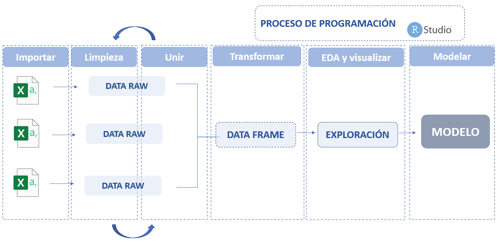

# nombre del documento 
<div style="text-align: justify">

El objetivo de este libro es ser un material de apoyo para los estudiantes que cursan el ramo de Data Analytics, con el fin de facilitar el aprendizaje de esta herramienta que les servirá para apoyar el desarrollo de sus trabajos. Además, esta materia sirve para las personas interesada en conocer y aprender un nuevo lenguaje.

## Lo que aprenderás

El objetivo de este, en particular, es entregarte una herramienta para poder comenzar en el mundo de ciencia de datos, para ello se condenso toda la información necesaria para que puedas realizar diferentes modelos que se muestran en este libro. Pero primero debes tener en cuenta el siguiente diagrama en donde se ilustra el proceso de programación que aprenderás. 

```{r echo=FALSE, out.width = "653px", out.height="320px",fig.align='center', fig.cap='Proceso de programación.'}

```

El primer proceso es la importación delos datos a R, estos se pueden presentar en diferentes formatos como CSV, EXCEL o en TXT, en cuanto el segundo y el tercer proceso depende de la persona que programe si quiere realizar la limpieza de los datos antes de unir o combinar los data frame. Entendiéndose como limpieza de los datos cuando existen datos vacíos o datos que presenta algún tipo de anomalías, todo esto lo veremos con mas detalle más adelante.  En cuanto a la transformación es el proceso en donde una vez consolidado en un solo data frame se procede a realizar operaciones o modificaciones como por ejemplo agregar una variable en base a las operaciones de otras variables etc… 
En cuanto al proceso de EDA y visualización en donde extraemos la información más relevante del data frame. Una buena visualización te mostrará cosas que no se contemplaron o hará surgir nuevas preguntas acerca de los datos. También puede darte pistas acerca de si estás haciendo las preguntas equivocadas o si necesitas recolectar datos diferentes. Para luego finalizar en el modelamiento en donde se aplica un modelo de machine learning.

## Cómo está organizado este libro

Este libro se divide en cinco partes, el primer capítulo trata sobre conceptos básicos sobre R y sobre programación, en el segundo capítulo se explica el lenguaje utilizado en R y los diferentes tipos y estructura de datos. en el tercer capitulo se explica algunas librerías principales para manejo de data frame con sus principales funciones.  Para luego el en cuarto capitulo condesar lo anteriormente aprendido importar, combinar y explorar una data, para finalizar con una introducción a machine learning tanto con modelos supervisados y no supervisado.

<div/>